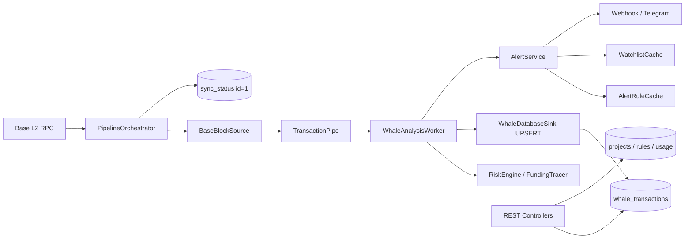

# LucentFlow Progress & Architecture Review

> **Version:** 1.2.0-STABLE  
> **Review date:** 2026-07-13  
> **Stack:** Java 21 (Virtual Threads) · Spring Boot 3.4 · Maven 3.9 · PostgreSQL 16 · Generational ZGC  
> **Author:** ArchLucent

---

## 1. Executive Verdict

LucentFlow 已从 Base L2 **链上哨兵**演进为具备 **B2B 多租户产品面** 的主权取证 OS。核心链路——**RPC 拉块 → TransactionPipe → RiskEngine → PostgreSQL → REST/Webhook**——在单体 Fat JAR 中打通；v1.2.0 的 Project / Watchlist / AlertRule / Usage 能力在代码与 Flyway（V13–V16）上基本对齐。

当前定位：**可用的 SaaS MVP（多项目隔离 + 告警 + 取证查询）**，尚非完整 enterprise B2B（缺配额 enforcement、RBAC、Key at-rest 硬化、充分自动化测试）。

| 维度 | 评级 | 说明 |
|------|------|------|
| 索引与 checkpoint | ★★★★★ | ID=1 Protocol + V16 数据库强制单例 |
| 风险分析 / Anti-Rug | ★★★★☆ | RiskEngine + Genesis Trace 成熟；事件驱动路径半废弃 |
| B2B 多租户 API | ★★★★☆ | CRUD / Key / 规则 / 计量已 wired；隔离边界有产品债 |
| 告警投递 | ★★★☆☆ | HMAC Webhook + Telegram；项目级 webhook 存在全局 URL gate |
| 安全与运营硬化 | ★★★☆☆ | 双 Key 拦截器到位；明文 Key、默认 seed key 需生产治理 |
| 测试与可演进性 | ★★☆☆☆ | 11 个测试类；analyzer / B2B API 几乎无覆盖 |
| 部署形态 | ★★★★☆ | Docker Compose + 零配置 CLI；无 K8s / 进程拆分 |

---

## 2. Architecture Overview

### 2.1 Module Map

| Module | Role | Notes |
|--------|------|-------|
| `lucentflow-common` | Entities, repositories, `TransactionPipe`, crypto / env utils | Shared domain layer |
| `lucentflow-chain-sdk` | Web3j auto-config, RPC tier & failover | PUBLIC vs PROFESSIONAL pacing |
| `lucentflow-indexer` | Block scan, concurrency governor, checkpoint, sink | `BaseBlockPoller` removed → `PipelineOrchestrator` |
| `lucentflow-analyzer` | Whale workers, RiskEngine, alerts, caches | Depends on indexer (coupling debt) |
| `lucentflow-api` | REST, Flyway, Swagger, Actuator, fat-JAR entry | Aggregates all modules |
| `lucentflow-deployment` | Docker Compose, `.env.example`, init scripts | Not in Maven reactor |

**Runtime shape:** single Spring Boot process (`LucentFlowApplication`, `scanBasePackages = com.lucentflow`) runs indexer + analyzer + API together. Root POM `${revision}` = `1.2.0-STABLE`; former `lucentflow-parent/pom.xml` consolidated into root `pom.xml`.

### 2.2 Data Flow

**Hard protocols (enforced in code + schema):**

- **ID=1 Protocol** — all sync read/write targets `sync_status.id = 1`; V16 adds `CHECK (id = 1)`.
- **Zero-loss pipe** — bounded `TransactionPipe` (capacity 5000); producer blocks, does not drop.
- **Native UPSERT** — whale persistence via `ON CONFLICT` for idempotent ingest.
- **Virtual Threads** — indexer parallelism, analysis workers, webhook, usage metering.

---

## 3. Release Progress

### Phase 1 — Core Sentinel (v1.0) ✅

- [x] Java 21 Virtual Threads indexing
- [x] TCV (Triple Cross-Validation) crypto paths
- [x] Dockerized stack (PostgreSQL / pgAdmin / Metabase)
- [x] Actuator health + Metabase dashboards
- [x] Whale query & sync-status public APIs

### Phase 2 — Forensic OS & Resilience (v1.1) ✅

- [x] Adaptive RPC pacing (PUBLIC safe defaults vs PROFESSIONAL overrides)
- [x] Zero-config CLI (`lucentflow.jar` + multi-path `.env` / proxy rewrite)
- [x] RpcConcurrencyGovernor + 429 soft-fail (no backup failover on rate limit)
- [x] Genesis Trace / Anti-Rug 2.0 signals
- [x] ERC-20 outpost fields, bytecode hash, execution_status
- [x] Entity tags / Tag Oracle seed (V10)
- [x] Telegram alerting baseline

### Phase 3 — B2B Productization (v1.2) ✅ Core / ⚠️ Hardening

| Capability | Status | Evidence |
|------------|--------|----------|
| Forensic query + JSON/CSV export | ✅ Done | `/api/v1/forensics/**`, JPA Specifications |
| Project-scoped watchlist | ✅ Done | V13 + `WatchlistCacheService` |
| Per-project alert rules | ✅ Done | V14 + `AlertRuleController` / `AlertRuleCacheService` |
| HMAC project webhooks | ⚠️ Wired w/ bug | See §5.1 |
| Admin project CRUD + key rotate | ✅ Done | `/api/v1/admin/projects`, `X-Admin-Key` |
| Daily API usage metering | ✅ Done | V15 + interceptor 2xx-only counter |
| sync_status singleton | ✅ Done | V16 + poller deletion |
| Docs / CHANGELOG / demo_setup | ✅ Mostly synced | README claims v1.2.0-STABLE |
| Quota / rate-limit enforcement | ✅ Done | Daily + per-minute; `0` disables |
| B2B unit tests (interceptors/quota/keys) | ✅ Done | Analyzer + API focused tests |
| API key at-rest hashing | ✅ Done | V18 SHA-256 |
| Public `/whales` product decision | ✅ Done | Free tier + IP soft limit |

### Phase 4 — Roadmap (from `docs/ROADMAP_v1.1.0.md`) 🚀 Next

- [ ] Genesis Trace 3.0 + Neo4j topology
- [ ] Broader multi-asset / price-oracle unification
- [ ] Historical backfill engine (on-demand)
- [ ] Discord / richer multi-channel alerting
- [ ] K8s / HA / optional process split (indexer ≠ API)

---

## 4. Feature Maturity Matrix

| Domain | Done | In progress | Gap |
|--------|------|-------------|-----|
| Block index + ID=1 checkpoint | ● | | |
| RPC tier / failover / backpressure | ● | | |
| RiskEngine + funding / rug signals | ● | | |
| ERC-20 + bytecode clone signals | ● | | |
| Entity tags | ● | | |
| Projects + API keys | ● | | Hashed at rest (V18) |
| Watchlist isolation | ● | | |
| Alert rules + cache | ● | | |
| Webhook HMAC fan-out | ● | | |
| API usage metering | ● | | + quota / rate-limit enforcement |
| Forensic query / export | ● | | |
| Public `/whales` | ● | | Free tier; IP soft rate-limited |
| Event-driven `AnalysisOrchestrator` | | Dead path | No `WhaleDetectedEvent` publisher |
| Split deploy / K8s | | | Monolith only |
| Analyzer & B2B tests | | | Near-zero coverage |

---

## 5. Architecture Review Findings

### 5.1 High priority

1. **~~Project webhook blocked by global URL gate~~** ✅ Fixed (2026-07-13)  
   `sendHighRiskAlertAsync` now gates on `resolveTargetWebhookUrl(context)` (project URL **or** global fallback), so project-only webhook configs deliver correctly. Covered by `WebhookAlertProviderTest`.

2. **~~Forensic empty-watchlist = full dataset~~** ✅ Fixed (2026-07-13)  
   Empty project watchlist now yields an empty forensic result set via `addressInSet([])` disjunction (tenant isolation).

3. **~~Bootstrap keys in schema / demo~~** ✅ Hardened (2026-07-13)  
   Flyway **V17** deactivates and rotates the well-known V13 `default-dev-key`. `demo_setup.sql` is documented as local/demo only.

### 5.2 Medium priority

4. **~~Inactive projects still receive pipeline alerts~~** ✅ Fixed (2026-07-13)  
   `AlertRuleCacheService` / `WatchlistCacheService` refresh skip `is_active=false` projects (`ActiveProjectCacheFilterTest`).

5. **~~Public whale APIs vs B2B narrative~~** ✅ Decided (2026-07-13)  
   Remain unauthenticated **platform free tier**; soft IP rate limit via `PublicApiRateLimitInterceptor`. Paid surfaces stay project-keyed.

6. **Dual analysis architecture**  
   Live path: `WhaleAnalysisWorker`. Unused path: `WhaleDetectedEvent` + `AnalysisOrchestrator` + handlers (no publisher found). Consolidate or delete to reduce cognitive load.

7. **Module dependency direction**  
   `analyzer → indexer` and API use of indexer repositories couple layers. Prefer sinking persistence into `common` (or a dedicated persistence module).

8. **~~Usage metering without enforcement~~** ✅ Fixed (2026-07-13)  
   `ProjectApiQuotaService` enforces daily quota + per-minute rate limit (HTTP 429).

9. **~~API key storage~~** ✅ Fixed (2026-07-13)  
   V18 persists `api_key_hash` + `api_key_prefix`; plaintext only on create/rotate.

10. **Config dualism**  
    Indexer module `application.yml` still uses `ddl-auto: update`; monolithic runtime uses API Flyway-only (`ddl-auto: none`). Easy foot-gun for newcomers.

### 5.3 Lower priority / tech debt

11. Web3j version pin drift (BOM 4.12.0 vs common explicit older pin — verify reactor resolution).  
12. `AlertRuleCacheService` full-table refresh on every upsert (OK for MVP scale).  
13. No project DELETE API (soft-disable only).  
14. Single shared `LUCENTFLOW_ADMIN_API_KEY` — no RBAC / audit trail.  
15. `WhaleAnalysisWorker` `CommandLineRunner` + `Thread.join()` blocks boot thread (works, fragile for graceful shutdown).  
16. Health aggregate may return HTTP 200 while component DOWN (probe-friendly; LB must parse JSON).

---

## 6. Database Migrations (V1–V18)

| Ver | Purpose |
|-----|---------|
| V1 | Initial `whale_transactions` + `sync_status` |
| V2 | Rug / funding analysis columns |
| V3 | `risk_score` / `risk_reasons` |
| V5 | `execution_status` integrity audit |
| V6 | Serial deployer query index |
| V7 | `bytecode_hash` |
| V8 | Token symbol / address |
| V9 | Sync metrics (`chain_head_block`, `block_lag`, `blocks_per_second`) |
| V10 | `entity_tags` + seed labels |
| V11 | `risk_reasons` → JSONB |
| V12 | Global watchlist |
| V13 | **`projects` multi-tenant**; watchlist `(project_id, address)` |
| V14 | **`alert_rules`** (1:1 per project) |
| V15 | **`project_api_usage`** daily counters |
| V16 | **`sync_status` singleton** `CHECK (id = 1)` |
| V17 | **Revoke** well-known V13 `default-dev-key` (deactivate + rotate) |
| V18 | **Hash** project API keys (`api_key_hash` + `api_key_prefix`) |

---

## 7. API Surface (v1.2)

| Layer | Auth | Endpoints |
|-------|------|-----------|
| Public | None | `/api/v1/whales`, `/whales/stats`, `/sync-status`, Actuator |
| Project | `X-Project-Key` | `/forensics/**`, `/watchlist/**`, `/alert-rules/**`, `/usage/**` |
| Admin | `X-Admin-Key` | `/admin/projects/**` (CRUD, rotate-key, usage) |

Demo bootstrap: `lucentflow-api/src/main/resources/db/demo_setup.sql`.  
Interactive docs: Swagger UI at `/swagger-ui/index.html`.

---

## 8. Test Coverage Snapshot

| Module | Test classes | Notes |
|--------|--------------|-------|
| common | 4 | Pipe, crypto, modular utils |
| indexer | 4 | RPC policy, governor, source, transformer |
| api | 6+ | Smoke + key/hash, quota, interceptors, specs |
| analyzer | 2 | Webhook gate + active-project cache filter |
| **Total** | **16+** | B2B auth/quota paths covered at unit level |

**Still thin:** full `@SpringBootTest`+MockMvc forensics/admin flows; AlertRule upsert end-to-end.

---

## 9. Recommended Next Steps (ordered)

| Priority | Action | Why |
|----------|--------|-----|
| P0 | Fix webhook global-URL early return | ✅ Fixed 2026-07-13 |
| P1 | Inactive project / empty watchlist / bootstrap key | ✅ Fixed 2026-07-13 |
| P2 | Quota / rate-limit, key hashing, public-tier decision, tests | ✅ Fixed 2026-07-13 |
| P3 | Remove or wire `WhaleDetectedEvent` path | Architecture clarity |
| P3 | Sink repositories to common / persistence module | Dependency hygiene |
| P3 | Unify indexer `ddl-auto` vs Flyway | Operator foot-gun |
| P3 | Roadmap: Neo4j / Trace 3.0 / optional process split | Phase 4 vision |

---

## 10. Working Tree Snapshot

P0–P2 hardening landed on `feature/v1.2.0-analytics` (see git log). Remaining focus: P3 tech debt and Phase 4 roadmap.

---

## 11. Conclusion

**Framework assessment:** Module boundaries are clear enough for a security sentinel monolith; protocols (ID=1, UPSERT, VT, adaptive RPC) are coherent and production-minded.

**Scheme assessment:** Multi-tenant isolation via hashed Project Key + watchlist-scoped forensics + quota enforcement is a viable SaaS MVP. Remaining gaps are mainly **architectural debt** (event path, module coupling) and **Phase 4 graph forensics / HA**.

**Overall progress:** Phase 1–2 complete; Phase 3 (B2B) complete through P2 hardening; Phase 4 not started.

---

*This document is the living architecture & progress record for LucentFlow. Update after each milestone or significant design decision.*
