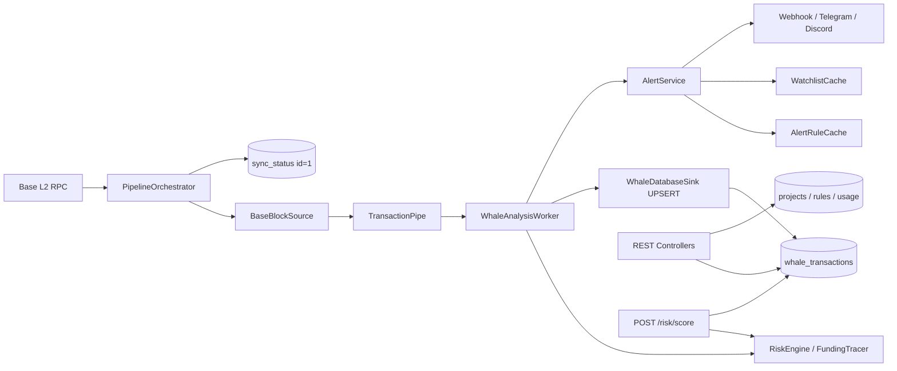

# LucentFlow Progress & Architecture Review

> **Agent files (do not treat this log as the contract):** [`AGENTS.md`](AGENTS.md) always-on · [`PROCESS.md`](PROCESS.md) attach to start a session (`@PROCESS.md` / `/process`).
>
> **Version:** 1.2.0-STABLE  
> **Review date:** 2026-08-25  
> **Stack:** Java 21 (Virtual Threads) · Spring Boot 3.4 · Maven 3.9 · PostgreSQL 16 · Generational ZGC  
> **Author:** ArchLucent

---

## 1. Executive Verdict

LucentFlow 已从 Base L2 **链上哨兵**演进为具备 **B2B 多租户产品面** 的主权取证 OS。核心链路——**RPC 拉块 → TransactionPipe → RiskEngine → PostgreSQL → REST/Webhook**——在模块化单体 Fat JAR 中打通；v1.2 的 Project / Watchlist / AlertRule / Usage 与 Flyway **V1** 对齐，商业套餐与配额列在 **V2**，watchlist 占用计数在 **V3**。

当前定位：**可用的 SaaS MVP（多项目隔离 + 计划配额 + 告警 + 取证查询 + 按需 Risk Score）**。尚非完整 enterprise B2B：无 RBAC / 审计。

| 维度 | 评级 | 说明 |
|------|------|------|
| 索引与 checkpoint | ★★★★★ | ID=1 Protocol + DB `CHECK (id = 1)` + 单调 `GREATEST` |
| 风险分析 / Anti-Rug | ★★★★☆ | RiskEngine.complete 为 ingest/API 共用收尾；点查始终拉 receipt+genesis，ingest 可跳过 |
| B2B 多租户 API | ★★★★☆ | CRUD / hashed Key / 规则 / V2 plan 配额 / V3 watchlist 占用 / 取证隔离已 wired |
| 告警投递 | ★★★★☆ | HMAC Webhook 按项目；Discord / Telegram 显式 global-only（合并 watchlist 标签） |
| 安全与运营硬化 | ★★★☆☆ | 双 Key 拦截器 + 分钟桶 / 日配额 / watchlist 占用均为原子预占；无 RBAC |
| 测试与可演进性 | ★★★☆☆ | ~45 个测试类（含 2 个 Testcontainers IT）；缺 shutdown 集成测试 |
| 部署形态 | ★★★★☆ | Docker Compose + K8s api/worker 拆分（worker `replicas: 1`）；Neo4j 仅为 compose 占位 |

---

## 2. Architecture Overview

### 2.1 Module Map

| Module | Role | Notes |
|--------|------|-------|
| `lucentflow-common` | Entities, repos, `TransactionPipe`, lease, shared rate limit, crypto / env, `ProjectPlan` | Shared domain layer |
| `lucentflow-chain-sdk` | Web3j auto-config, RPC tier & failover | PUBLIC vs PROFESSIONAL pacing；429 不切 backup |
| `lucentflow-pipeline-contract` | Ports: `BlockSourcePort`, `FundingTracerPort`, `WhaleTransactionSink` | Analyzer 编译期不依赖 indexer |
| `lucentflow-indexer` | Block scan, governor, checkpoint, sink, funding tracer impl | `PipelineOrchestrator`；运行期绑定 ports |
| `lucentflow-analyzer` | Whale workers, RiskEngine, alerts, topology, caches | Maven 依赖 contract；运行期仍绑 indexer 实现 |
| `lucentflow-api` | REST, Flyway, Swagger, Actuator, fat-JAR entry | Aggregates all modules |
| `lucentflow-deployment` | Docker Compose, K8s, `.env.example` | Not in the Maven reactor |

**Runtime shape:** `LucentFlowApplication` (`scanBasePackages = com.lucentflow`) 默认同进程跑 indexer + analyzer + API。Profiles `api` / `worker` 经 `lucentflow.runtime.enable-*` 拆进程：API 可水平扩展；worker **必须单副本**（lease 是防御，不是多 writer 绿灯）。Root POM `${revision}` = `1.2.0-STABLE`。

### 2.2 Data Flow

**Hard protocols (enforced in code + schema):**

- **ID=1 Protocol** — all sync read/write targets `sync_status.id = 1` (`CHECK (id = 1)` in Flyway V1)；进度用 `GREATEST`，禁止无条件覆盖回退高度。
- **Zero-loss pipe** — bounded `TransactionPipe` (capacity 5000)；运行期 producer 阻塞不丢。Analyzer 对已 drain 批次 **UPSERT 重试至成功**；关停打断后仍做一次 last-chance persist，失败则 ERROR 打出 hash（无法无限拖住进程）。
- **Native UPSERT** — whale persistence via `ON CONFLICT (hash)`；ingest 热路径不用 JPA `save`。
- **RPC 429** — pacing / backpressure；**不** failover 到 backup URL。
- **Virtual Threads** — indexer parallelism, analysis workers, webhook, usage metering, risk-score lookups.

---

## 3. Release Progress

### Phase 1 — Core Sentinel (v1.0) ✅

- [x] Java 21 Virtual Threads indexing
- [x] TCV (Triple Cross-Validation) crypto paths
- [x] Dockerized stack (PostgreSQL / pgAdmin / Metabase)
- [x] Actuator health + Metabase dashboards
- [x] Whale query & sync-status public APIs

### Phase 2 — Forensic OS & Resilience (v1.1) ✅

- [x] Adaptive RPC pacing (PUBLIC safe defaults vs PROFESSIONAL overrides)
- [x] Zero-config CLI (`lucentflow.jar` + multi-path `.env` / proxy rewrite)
- [x] RpcConcurrencyGovernor + 429 soft-fail (no backup failover on rate limit)
- [x] Genesis Trace / Anti-Rug 2.0 signals
- [x] ERC-20 outpost fields, bytecode hash, execution_status
- [x] Entity tags / Tag Oracle seed (in Flyway V1)
- [x] Telegram alerting baseline

### Phase 3 — B2B Productization (v1.2) ✅ Core / ⚠️ Hardening

| Capability | Status | Evidence |
|------------|--------|----------|
| Forensic query + JSON/CSV export | ✅ Done | `/api/v1/forensics/**`；空 watchlist → 空结果 + `X-LucentFlow-Scope` |
| Project-scoped watchlist | ✅ Done | `(project_id, address)` + `WatchlistCacheService`；V2 `watchlist_limit`；V3 `project_watchlist_usage` 原子占用 |
| Per-project alert rules | ✅ Done | `AlertRuleController` / `AlertRuleCacheService` |
| HMAC project webhooks | ✅ Done | Project URL + optional `webhook_secret`；全局 URL 不再提前 return |
| Admin project CRUD + key rotate | ✅ Done | `/api/v1/admin/projects`，`X-Admin-Key` |
| Daily API usage metering | ✅ Done | `project_api_usage`；拦截器仅计 2xx |
| Quota / rate-limit enforcement | ✅ Done | 分钟桶 + 日配额均为 PG 原子 UPSERT；非 2xx 退回日预占 |
| Commercial plans | ✅ Done | Flyway **V2** `plan` / `daily_request_quota` / `watchlist_limit`（BUILDER 2000/50，DESK 20000/200，PROTOCOL 100000/1000） |
| On-demand Risk Score | ✅ Done | `POST /api/v1/risk/score`；`RiskEngine.complete`；点查 fetch 更深（契约已标明） |
| sync_status singleton | ✅ Done | `CHECK (id = 1)` + poller deletion |
| Docs / CHANGELOG / demo_setup | ✅ Synced | `docs/schema/SCHEMA_CURRENT.md` 含 V2 + V3 |
| B2B unit tests | ✅ Done | Auth / quota / cache / persist-then-alert / topology miss+hit |
| API key at-rest hashing | ✅ Done | SHA-256 `api_key_hash` + prefix |
| Public `/whales` product decision | ✅ Done | Free tier + IP soft limit |

### Phase 4 — Foundation landed / remaining iterative

| Capability | Status | Evidence |
|------------|--------|----------|
| Discord alerting | ✅ Landed | `DiscordAlertProvider`；operator-global，合并 watchlist 标签后发一次 |
| Historical backfill admin API | ✅ Landed | `POST /api/v1/admin/backfill` |
| Genesis Trace 3.0 topology (Postgres) | ✅ Landed | `funding_edges` + `GET /forensics/topology/{address}`（watchlist 门控查询地址，边为全局图） |
| ETH/USD oracle | ✅ Landed | `GET /api/v1/oracle/eth-usd` |
| Runtime split + K8s manifests | ✅ Landed | `api` / `worker` profiles；worker `replicas: 1` + Recreate + deny-ingress |
| Worker probes | ✅ Landed | `/actuator/health` readiness/liveness |
| CI + Testcontainers | ✅ Landed | `mvn verify`；Flyway + forensic isolation ITs |
| Neo4j Cypher sync | 🚀 Iterative | Compose profile + `Neo4jTopologyMirror` 占位；查询源仍是 Postgres |
| Broader multi-asset / price feeds | 🚀 Iterative | ERC-20 outpost 仅 core token 列表 |
| Multi-replica worker failover | 🚀 Iterative | Lease 已落地；部署策略仍强制单 writer |

---

## 4. Feature Maturity Matrix

| Domain | Done | In progress | Gap |
|--------|------|-------------|-----|
| Block index + ID=1 checkpoint | ● | | |
| RPC tier / failover / backpressure | ● | | |
| RiskEngine + funding / rug signals | ● | | 点查 fetch 比 ingest 更全（契约已标明） |
| ERC-20 + bytecode clone signals | ● | | Core-token 列表有限 |
| Entity tags | ● | | |
| Projects + API keys | ● | | Hashed at rest (`api_key_hash`) |
| Commercial plan + per-project quota columns | ● | | |
| Watchlist isolation + write cap | ● | | |
| Alert rules + cache | ● | | Full-table refresh on upsert |
| Webhook HMAC fan-out | ● | | Bulkhead 超时 ERROR + failure 计数 |
| Discord / Telegram | ● | | 显式 global-only；合并标签 |
| Forensic query / export | ● | | 导出 SQL LIMIT 默认 10000 |
| Topology (Postgres `funding_edges`) | ● | | 命中后边为全局图 |
| Risk Score API | ● | | `RiskEngine.complete`；coverage=indexed 仍是 live 分 |
| Public `/whales` | ● | | Free tier; IP soft rate-limited |
| Event-driven `AnalysisOrchestrator` | | | Removed (dead path) |
| Split deploy / K8s | ● | | Worker 单副本；HA failover 未验证 |
| Analyzer & B2B tests | ● | | 缺 shutdown 集成测试 |
| Neo4j graph sync | | ● | 占位，非查询源 |

---

## 5. Architecture Review Findings

### 5.1 Open — high priority (2026-08-25)

（无剩余 P0。）

### 5.2 Open — medium priority (2026-08-25)

4. **~~日配额 check-then-act~~** ✅ Fixed (2026-08-25)  
   `DailyApiUsageLedger` 在 admit 时原子 UPSERT（`WHERE request_count < quota`）；非 2xx 在 `afterCompletion` 退回。分钟限流仍是 `api_rate_limit_buckets`。Risk Score 503/504 仍不计日配额（预占后 refund）。

5. **~~Catch-up 阈值两套~~** ✅ Fixed (2026-08-25)  
   `isCatchUpMode()` 与 genesis skip 共用 `getBlockLagCached()`；阈值 `lucentflow.analyzer.catch-up-lag-blocks`（默认 500）。lag 读失败 fail-open（不跳过 trace）。

6. **~~AddressLabeler 数据错误~~** ✅ Fixed (2026-08-25)  
   Base USDC (`0x8335…2913`) 标为 `USDC`。`isExchange()` 仅 Coinbase/Exchange；Uniswap / Aerodrome / USDC / WETH 归 `DEFI`。

7. **~~Discord / Telegram under-alert~~** ✅ Fixed (2026-08-25)  
   Discord / Telegram 显式 **operator-global**：每条 whale 发一次，`mergeForGlobalChannel` 合并 watchlist 标签（不再只取 `getFirst()`）。Webhook bulkhead 等待 `bulkhead-acquire-timeout-ms`（默认 10s），超时 ERROR + `markFailure`。

8. **~~取证导出无 row cap~~** ✅ Fixed (2026-08-25)  
   JSON/CSV 使用 FluentQuery `limit`（默认 10000，`maxRows` 可下调）。导出 Controller 不再包只读事务；响应头 `X-LucentFlow-Export-Max-Rows` / `Matched` / `Truncated`。

9. **拓扑信息面**  
   Watchlist miss → 空边（正确）；命中后返回全局 `funding_edges`，对端不必在本项目 watchlist。产品定义如此，需在文档中保持显式。

### 5.3 Closed (2026-07-13 ship + 2026-08-25 ingress)

9. **~~Ingress 分裂 + UPSERT 静默丢批 + 评分公式分叉~~** ✅ Fixed (2026-08-25)  
   共用 `WhaleIngressFilter`；`persistThenAlertUntilSuccess` 重试至成功；`RiskEngine.complete` 为 ingest persist 与 Risk Score API 的同一套 revert/blacklist/clamp。点查仍始终尝试 receipt + genesis（热路径可跳过），契约写在 `docs/API-DOCUMENTATION.md`：`coverage=indexed` 不表示 `score` 等于库内 ingest 分。

10. **~~Project webhook blocked by global URL gate~~** ✅  
    `sendHighRiskAlertAsync` 以 `resolveTargetWebhookUrl(context)` 为准（项目 URL 或全局 fallback）。`WebhookAlertProviderTest`。

11. **~~Forensic empty-watchlist = full dataset~~** ✅  
    空 watchlist → `addressInSet([])`；`projectId == null` fail-closed。`ForensicTenantIsolationIT`。

12. **~~Bootstrap keys in schema / demo~~** ✅  
    V1 仅存 hashed key；`demo_setup.sql` 仅本地。

13. **~~Inactive projects still receive pipeline alerts~~** ✅  
    缓存跳过 `is_active=false`。`ActiveProjectCacheFilterTest`。

14. **~~Public whale APIs vs B2B narrative~~** ✅  
    保持未认证 free tier；`PublicApiRateLimitInterceptor`。

15. **~~Dual analysis architecture~~** ✅  
    删除 `WhaleDetectedEvent` / `AnalysisOrchestrator`。活路径仅 `WhaleAnalysisWorker`。

16. **~~Repositories in wrong module~~** ✅  
    Whale / sync / entity-tag repos 在 `lucentflow-common`。Analyzer Maven 依赖 `pipeline-contract`，运行期仍绑 indexer 实现。

17. **~~Usage metering without enforcement~~** ✅  
    `ProjectApiQuotaService` + V2 列；分钟与日配额均为原子 UPSERT。

18. **~~API key plaintext at rest~~** ✅  
    `api_key_hash` + prefix；明文仅 create/rotate 返回。

19. **~~Indexer ddl-auto vs Flyway~~** ✅  
    Indexer `ddl-auto: none`，`flyway.enabled: false`；schema 由 `lucentflow-api` Flyway 拥有。

20. **~~`WhaleAnalysisWorker` CommandLineRunner + join~~** ✅  
    `SmartLifecycle`；phase 在 indexer 之后 drain pipe。缺 shutdown 集成测试。

### 5.4 Lower priority / tech debt

21. **~~Web3j pin drift~~** ✅ Fixed (2026-08-25)  
    父 POM `${web3j.version}=4.12.0` 管理 `core` / `utils` / `crypto`；common 不再写死 4.10.0。  
22. `AlertRuleCacheService` 每次 upsert 全表刷新（MVP 可接受）。  
23. 无 project DELETE API（仅 soft-disable）。  
24. 单一 `LUCENTFLOW_ADMIN_API_KEY` — 无 RBAC / 审计。  
25. Health 聚合可能 HTTP 200 而 component DOWN（probe-friendly；LB 须解析 JSON）。  
26. `Neo4jTopologyMirror` 仅 announce；查询源是 Postgres。  
27. **~~Risk Score 内存 cache 无驱逐；4xx/5xx 无 JSON body~~** ✅ Fixed (2026-08-25)  
    Caffeine TTL + max-size；400/503/504 返回 `{status,error,message}`。  
28. **~~Worker `Instant.now()` 作交易时间戳~~** ✅ Fixed (2026-08-25)  
    Indexer `push(tx, blockTimestamp)`；analyzer 用 piped 块时间写入 `whale_transactions.timestamp`。  
29. **~~Watchlist count-then-insert~~** ✅ Fixed (2026-08-25)  
    `WatchlistCapLedger` 原子 UPSERT（`WHERE address_count < watchlist_limit`）；insert 失败与 delete 退回占用。

---

## 6. Database Migrations

Former incremental V1–V21 history was **squashed** into a single greenfield baseline (no production DB). See [`docs/schema/SCHEMA_CURRENT.md`](docs/schema/SCHEMA_CURRENT.md).

| Ver | Purpose |
|-----|---------|
| V1 | Full schema: whale, sync (ID=1), entity_tags, funding_edges, projects (hashed keys), watchlist, alert_rules, usage, worker_leases, api_rate_limit_buckets |
| V2 | `projects.plan` (`BUILDER` / `DESK` / `PROTOCOL`) + `daily_request_quota` + `watchlist_limit`；`0` 禁用对应上限 |
| V3 | `project_watchlist_usage` occupancy counter；create 原子预占、delete/失败退回 |

已有行在 V2 中得到 BUILDER 默认值（2000 / 50），不会按历史意图回填更高套餐。

---

## 7. API Surface (v1.2)

| Layer | Auth | Endpoints |
|-------|------|-----------|
| Public | None | `/api/v1/whales`, `/whales/stats`, `/sync-status`, `/oracle/eth-usd`, Actuator |
| Project | `X-Project-Key` | `/forensics/**`（含 topology）, `/watchlist/**`, `/alert-rules/**`, `/usage/**`, `/risk/**` |
| Admin | `X-Admin-Key` | `/admin/projects/**`（CRUD, rotate-key, usage, `plan`）, `/admin/backfill` |

配额：`projects.daily_request_quota`（BUILDER 默认 2000）+ `LUCENTFLOW_API_RATE_LIMIT_PER_MINUTE`；超限 HTTP 429。Watchlist 写入受 `watchlist_limit` 约束，占用经 `project_watchlist_usage` 原子 UPSERT。`LUCENTFLOW_API_DAILY_REQUEST_QUOTA` 仅为行缺失时的 fallback。

Demo bootstrap: `lucentflow-api/src/main/resources/db/demo_setup.sql`（本地）。  
Interactive docs: Swagger UI at `/swagger-ui/index.html`。  
Product docs: [`docs/API-DOCUMENTATION.md`](docs/API-DOCUMENTATION.md)。

---

## 8. Test Coverage Snapshot

| Module | Test classes | Notes |
|--------|--------------|-------|
| common | 11 | Pipe, ingress filter, crypto, lease, shared rate limit, daily usage ledger, watchlist occupancy ledger, `ProjectPlan` |
| indexer | 6 | RPC policy, governor, source, transformer, sink UPSERT, checkpoint GREATEST |
| analyzer | 11 | Webhook gate, AlertService fan-out, persist-then-alert, catch-up lag, RiskEngine, AddressLabeler, topology persist, shouldAlert 矩阵, Discord/Telegram 空配置 |
| api | 16 | Quota, interceptors, specs, RiskScore live vs ingest, AlertRule MockMvc, Watchlist 原子 cap/`limit=0`/refund, topology miss+hit, K8s gate, 2× Testcontainers IT（含 V3） |
| chain-sdk | 1 | `RpcFailoverInterceptor`：429 不切 backup；500 才切 |
| pipeline-contract | 0 | 端口模块，无运行时逻辑 |
| **Total** | **~45** | Auth/quota/isolation 有单元覆盖；ITs 覆盖 Flyway V1–V3 + empty-watchlist |

**Still thin:** SmartLifecycle drain 超时窗口。

---

## 9. Recommended Next Steps (ordered)

Closed 2026-07-13（webhook gate、empty watchlist、hashed keys、inactive filter、配额落地、事件路径删除、repos 下沉、Flyway 所有权、SmartLifecycle、Discord、backfill、topology、K8s split、oracle、CI/IT、worker probes）不再逐条列出。

| Priority | Action | Why |
|----------|--------|-----|
| P0 | ~~对齐 `BaseBlockSource.isWhaleTransaction` 与 `WhaleAnalysisWorker.isWhale`~~ | ✅ Fixed 2026-08-25 — `WhaleIngressFilter` |
| P0 | ~~UPSERT 失败重试或死信（async catch 后不丢批）~~ | ✅ Fixed 2026-08-25 — `persistThenAlertUntilSuccess` |
| P1 | ~~统一 Worker / Risk Score 评分路径，或在 API 契约中标明差异~~ | ✅ Fixed 2026-08-25 — `RiskEngine.complete` + API 文档标明 live vs ingest fetch |
| P1 | ~~日配额原子预占（与分钟桶同一 UPSERT 套路）~~ | ✅ Fixed 2026-08-25 — `DailyApiUsageLedger` + 非 2xx refund |
| P2 | ~~Watchlist cap 原子预占（与日配额同一 UPSERT 套路）~~ | ✅ Fixed 2026-08-25 — `WatchlistCapLedger` + V3 occupancy |
| P2 | ~~合并 catch-up 500 vs 5000 为单一配置~~ | ✅ Fixed 2026-08-25 — `catch-up-lag-blocks` 默认 500 |
| P2 | ~~修正 USDC 标签；Router ≠ Exchange~~ | ✅ Fixed 2026-08-25 |
| P2 | ~~Discord/Telegram 显式 global-only；Webhook bulkhead 不再静默丢~~ | ✅ Fixed 2026-08-25 |
| P2 | ~~导出 row limit~~ | ✅ Fixed 2026-08-25 — `export-max-rows` 默认 10000 |
| P3 | ~~统一 Web3j 4.12.0 pin；Risk Score cache 驱逐；错误 JSON body~~ | ✅ Fixed 2026-08-25 |
| P4+ | Neo4j Cypher sync / 更广价格源 / worker 多副本 failover 验证 | 仍 iterative |
| P1 ops | 共享限流已用 PG 分钟桶；leader election 已落地但部署仍单 writer | 多节点需先验证 lease 窗口 |

---

## 10. Working Tree Snapshot

审查日 2026-08-25 的增量：Flyway **V2** plan/quota、**V3** watchlist occupancy、`POST /api/v1/risk/score`、topology watchlist 门控、AddressLabeler `Locale.ROOT` 规范化、Worker 风险因子 memo 缓存、对应单元测试。分支语境仍是 v1.2.0 产品面加固，不是新 major。

剩余焦点：**P4+ Neo4j Cypher sync / worker 多副本 failover 验证**；SmartLifecycle drain 超时窗口次之。

---

## 11. Conclusion

**Framework assessment:** 模块边界对安全哨兵单体足够清晰；`pipeline-contract` 解开了 analyzer 的编译依赖。硬协议（ID=1、UPSERT、VT、429 不切 backup）在代码与 schema 中仍一致。Pipe 运行期不丢；已 drain 批次 UPSERT 失败会重试至成功（关停 last-chance 仍失败则记 hash）。

**Scheme assessment:** hashed Project Key + watchlist 取证 + V2 plan 配额 + V3 watchlist 占用是可用的 SaaS MVP。Risk Score 按设计不走 watchlist（点查任意地址）；`score` 与 ingest 共用 `RiskEngine.complete`，fetch 深度在契约中标明。日配额与 watchlist 占用均在 admit 时原子预占，失败/非 2xx 退回。

**Overall progress:** Phase 1–3 完成；Phase 4 基础已落地（Discord、backfill、Postgres topology、K8s api/worker、oracle、CI）。Ingress / sink 重试 / 评分收尾 / 日配额预占 / watchlist 占用预占 / AddressLabeler / catch-up 阈值已对齐。回归单测已补 catch-up、shouldAlert、watchlist 原子 cap、topology 命中全局边、Risk Score 忽略库内 ingest 分、429 不切 backup。下一步是 Neo4j Cypher sync、worker 多副本 failover 验证、SmartLifecycle drain 超时窗口。

---

*This document is the living architecture & progress record for LucentFlow. Update after each milestone or significant design decision.*
