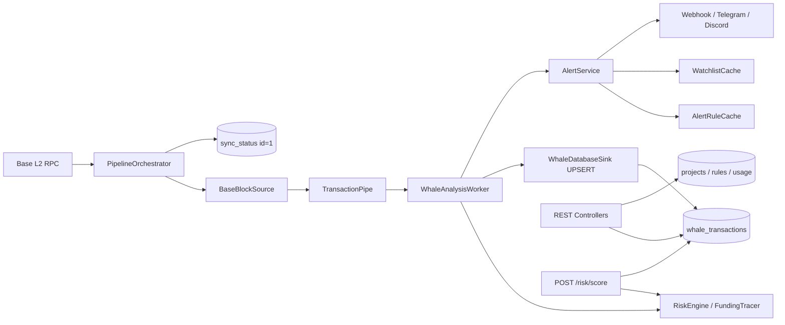

# LucentFlow Progress & Architecture Review

> **Agent files (do not treat this log as the contract):** [`AGENTS.md`](AGENTS.md) always-on · [`PROCESS.md`](PROCESS.md) attach to start a session (`@PROCESS.md` / `/process`).
>
> **How to read:** §1 verdict + **Current board** = today’s kanban (the only open-work list). §2–§8 = architecture memo. §5 = closed this cycle. Product contract: [`docs/API-DOCUMENTATION.md`](docs/API-DOCUMENTATION.md).
>
> **Version:** 1.2.0-STABLE  
> **Review date:** 2026-08-26  
> **Stack:** Java 21 (Virtual Threads) · Spring Boot 3.4 · Maven 3.9 · PostgreSQL 16 · Generational ZGC  
> **Author:** ArchLucent

---

## 1. Executive Verdict

LucentFlow 已从 Base L2 **链上哨兵**演进为具备 **B2B 多租户产品面** 的主权取证 OS。核心链路——**RPC 拉块 → TransactionPipe → RiskEngine → PostgreSQL → REST/Webhook**——在模块化单体 Fat JAR 中打通；v1.2 的 Project / Watchlist / AlertRule / Usage 与 Flyway **V1** 对齐，商业套餐与配额列在 **V2**，watchlist 占用计数在 **V3**。

当前定位：**可用的 SaaS MVP（多项目隔离 + 计划配额 + 告警 + 取证查询 + 按需 Risk Score）**。尚非完整 enterprise B2B：无 RBAC / 审计。

| 维度 | 评级 | 说明 |
|------|------|------|
| 索引与 checkpoint | ★★★★★ | ID=1 Protocol + DB `CHECK (id = 1)` + 单调 `GREATEST` |
| 风险分析 / Anti-Rug | ★★★★☆ | RiskEngine.complete 为 ingest/API 共用收尾；点查始终拉 receipt+genesis，ingest 可跳过 |
| B2B 多租户 API | ★★★★☆ | 项目无 DELETE（软关：`PUT /api/v1/admin/projects/{id}` body `isActive`）；hashed Key / 规则 / V2 plan 配额 / V3 watchlist 占用 / 取证隔离已 wired |
| 告警投递 | ★★★★☆ | HMAC Webhook 按项目；Discord / Telegram 显式 global-only；bulkhead 超时进内存死信再重试 |
| 安全与运营硬化 | ★★★☆☆ | 双 Key 拦截器 + 分钟桶 / 日配额 / watchlist 占用均为原子预占；无 RBAC |
| 测试与可演进性 | ★★★☆☆ | 截至本评审日 47 个 `*Test`/`*IT` 类（含 2 个 Testcontainers IT）。有 shutdown 单测，缺全进程关停 IT |
| 部署形态 | ★★★★☆ | Docker Compose + K8s api/worker 拆分（worker `replicas: 1`）；Neo4j 仅为 compose 占位 |

### Current board (single source of open work)

Update this table when a row ships. Do not copy these rows into §5.

**Standing (not a ticket):** topology lookup is watchlist-gated; a hit returns the **global** `funding_edges` graph. Contract: §7 and [`docs/API-DOCUMENTATION.md`](docs/API-DOCUMENTATION.md).

| P | Item | Done when |
|---|------|-----------|
| P3 | 全进程 SmartLifecycle 关停 IT | 有 IT 覆盖 indexer+analyzer 停机时 pipe drain + last-chance flush（现有仅为 `WhaleAnalysisWorkerShutdownTest`） |
| P3 | Webhook 死信落盘或出进程 | 重启不丢未投递项，或 runbook 明确接受内存队列丢失 |
| P3 | Health 探针策略 | 要么接受 `jsonRpc` DOWN / webhook `WARN` 不踢 pod，要么改探针去解析 JSON（今日 `/actuator/health` HTTP 200 mapping，kubelet 不读 body） |
| P4 | AlertRule 增量缓存 | upsert 后热路径不再全表 `findAll` 刷新 |
| P4 | Project 硬删 | `DELETE /api/v1/admin/projects/{id}` 落地，或文档标明 MVP 只做 `PUT /{id}` body `isActive` 软关 |
| P4 | RBAC + 审计 | 正式角色模型 + 审计日志，或文档标明 MVP 不做 |
| P4+ | Neo4j Cypher sync | 查询源可切图库（今日 `Neo4jTopologyMirror` 占位，源仍是 Postgres） |
| P4+ | 更广价格源 | 超出 core-token 列表的多资产报价 |
| P4+ | worker 多副本 failover | `replicas>1` 在 lease 下验证不双写 checkpoint。**在此之前 lease 只是防御，不是多 writer 绿灯** |

---

## 2. Architecture Overview

### 2.1 Module Map

| Module | Role | Notes |
|--------|------|-------|
| `lucentflow-common` | Entities, repos, `TransactionPipe`, lease, shared rate limit, crypto / env, `ProjectPlan` | Shared domain layer |
| `lucentflow-chain-sdk` | Web3j auto-config, RPC tier & failover | PUBLIC vs PROFESSIONAL pacing；429 不切 backup |
| `lucentflow-pipeline-contract` | Ports: `BlockSourcePort`, `FundingTracerPort`, `WhaleTransactionSink` | Analyzer 编译期不依赖 indexer |
| `lucentflow-indexer` | Block scan, governor, checkpoint, sink, funding tracer impl | `PipelineOrchestrator`；运行期绑定 ports |
| `lucentflow-analyzer` | Whale workers, RiskEngine, alerts, topology, caches | Maven 依赖 contract；运行期仍绑 indexer 实现 |
| `lucentflow-api` | REST, Flyway, Swagger, Actuator, fat-JAR entry | Aggregates all modules |
| `lucentflow-deployment` | Docker Compose, K8s, `.env.example` | Not in the Maven reactor |

**Runtime shape:** `LucentFlowApplication` (`scanBasePackages = com.lucentflow`) 默认同进程跑 indexer + analyzer + API。Profiles `api` / `worker` 经 `lucentflow.runtime.enable-*` 拆进程：API 可水平扩展；worker **必须单副本**（lease 是防御，不是多 writer 绿灯）。Root POM `${revision}` = `1.2.0-STABLE`。

### 2.2 Data Flow

**Hard protocols (enforced in code + schema):**

- **ID=1 Protocol** — all sync read/write targets `sync_status.id = 1` (`CHECK (id = 1)` in Flyway V1)；进度用 `GREATEST`，禁止无条件覆盖回退高度。
- **Zero-loss pipe** — bounded `TransactionPipe` (capacity 5000)；运行期 producer 阻塞不丢。Analyzer 对已 drain 批次 **UPSERT 重试至成功**；关停先等 workers 排空（默认 120s），再在 `SmartLifecycle.stop` 线程 **last-chance flush**。`TransactionPipe.@PreDestroy` 若仍有剩余则 ERROR 并清空（JVM 正在退出；analyzer 应已 flush）。K8s worker `terminationGracePeriodSeconds: 180` 与 worker / 默认进程 `timeout-per-shutdown-phase: 180s` 对齐；**API-only** profile 为 30s（无 pipe 排空）。
- **Native UPSERT** — whale persistence via `ON CONFLICT (hash)`；ingest 热路径不用 JPA `save`。
- **RPC 429** — pacing / backpressure；**不** failover 到 backup URL。
- **Virtual Threads** — indexer parallelism, analysis workers, webhook dispatch, risk-score lookups（配额计量走请求线程上的 JDBC，无独立 VT 池）。

---

## 3. Release Progress

### Phase 1 — Core Sentinel (v1.0) ✅

- [x] Java 21 Virtual Threads indexing
- [x] TCV (Triple Cross-Validation) crypto paths
- [x] Dockerized stack (PostgreSQL / pgAdmin / Metabase)
- [x] Actuator health + Metabase dashboards
- [x] Whale query & sync-status public APIs

### Phase 2 — Forensic OS & Resilience (v1.1) ✅

- [x] Adaptive RPC pacing (PUBLIC safe defaults vs PROFESSIONAL overrides)
- [x] Zero-config CLI (`lucentflow.jar` + multi-path `.env` / proxy rewrite)
- [x] RpcConcurrencyGovernor + 429 soft-fail (no backup failover on rate limit)
- [x] Genesis Trace / Anti-Rug 2.0 signals
- [x] ERC-20 outpost fields, bytecode hash, execution_status
- [x] Entity tags / Tag Oracle seed (in Flyway V1)
- [x] Telegram alerting baseline

### Phase 3 — B2B Productization (v1.2) ✅ Core / ⚠️ Hardening

| Capability | Status | Evidence |
|------------|--------|----------|
| Forensic query + JSON/CSV export | ✅ Done | `/api/v1/forensics/**`；空 watchlist → 空结果 + `X-LucentFlow-Scope` |
| Project-scoped watchlist | ✅ Done | `(project_id, address)` + `WatchlistCacheService`；V2 `watchlist_limit`；V3 `project_watchlist_usage` 原子占用 |
| Per-project alert rules | ✅ Done | `AlertRuleController` / `AlertRuleCacheService` |
| HMAC project webhooks | ✅ Done | Project URL + optional `webhook_secret`；全局 URL 不再提前 return |
| Admin project 无 DELETE + key rotate | ✅ Done | `/api/v1/admin/projects`；软关 `PUT /{id}` body `isActive`；`X-Admin-Key` |
| Daily API usage metering | ✅ Done | `project_api_usage`；拦截器仅计 2xx |
| Quota / rate-limit enforcement | ✅ Done | 分钟桶 + 日配额均为 PG 原子 UPSERT；日拒绝退分钟桶；非 2xx 退回日预占 |
| Commercial plans | ✅ Done | Flyway **V2** `plan` / `daily_request_quota` / `watchlist_limit`（BUILDER 2000/50，DESK 20000/200，PROTOCOL 100000/1000） |
| On-demand Risk Score | ✅ Done | `POST /api/v1/risk/score`；`RiskEngine.complete`；点查 fetch 更深（契约已标明） |
| sync_status singleton | ✅ Done | `CHECK (id = 1)` + poller deletion |
| Docs / CHANGELOG / demo_setup | ✅ Done | SCHEMA V2+V3；CHANGELOG Unreleased webhook 死信；API topology 全局边 + health HTTP 200 mapping |
| B2B unit tests | ✅ Done | Auth / quota / cache / persist-then-alert / topology miss+hit |
| API key at-rest hashing | ✅ Done | SHA-256 `api_key_hash` + prefix |
| Public `/whales` product decision | ✅ Done | Free tier + IP soft limit |

### Phase 4 — Foundation landed / remaining iterative

| Capability | Status | Evidence |
|------------|--------|----------|
| Discord alerting | ✅ Landed | `DiscordAlertProvider`；operator-global，合并 watchlist 标签后发一次 |
| Historical backfill admin API | ✅ Landed | `POST /api/v1/admin/backfill` 挂在 indexer 进程；API-only 503 + worker port-forward |
| Genesis Trace 3.0 topology (Postgres) | ✅ Landed | `funding_edges` + `GET /forensics/topology/{address}`（watchlist 门控查询地址，边为全局图） |
| ETH/USD oracle | ✅ Landed | `GET /api/v1/oracle/eth-usd` |
| Runtime split + K8s manifests | ✅ Landed | `api` / `worker` profiles；worker `replicas: 1` + Recreate + deny-ingress |
| Worker probes | ✅ Landed | `/actuator/health` readiness/liveness（HTTP 200 mapping；见 §1 Current board / §7） |
| CI + Testcontainers | ✅ Landed | `mvn verify`；Flyway + forensic isolation ITs |
| Neo4j Cypher sync | 🚀 Iterative | Compose profile + `Neo4jTopologyMirror` 占位；查询源仍是 Postgres |
| Broader multi-asset / price feeds | 🚀 Iterative | ERC-20 outpost 仅 core token 列表 |
| Multi-replica worker failover | 🚀 Iterative | Lease 已落地；部署策略仍强制单 writer |

---

## 4. Feature Maturity Matrix

| Domain | Done | In progress | Gap |
|--------|------|-------------|-----|
| Block index + ID=1 checkpoint | ● | | |
| RPC tier / failover / backpressure | ● | | |
| RiskEngine + funding / rug signals | ● | | 点查 fetch 比 ingest 更全（契约已标明） |
| ERC-20 + bytecode clone signals | ● | | Core-token 列表有限 |
| Entity tags | ● | | |
| Projects + API keys | ● | | Hashed at rest (`api_key_hash`) |
| Commercial plan + per-project quota columns | ● | | |
| Watchlist isolation + write cap | ● | | |
| Alert rules + cache | ● | | Full-table refresh on upsert |
| Webhook HMAC fan-out | ● | | Bulkhead 超时进有界内存死信；满队列 / 耗尽 attempts 才 ERROR |
| Discord / Telegram | ● | | 显式 global-only；合并标签 |
| Forensic query / export | ● | | 导出 SQL LIMIT 默认 10000 |
| Topology (Postgres `funding_edges`) | ● | | 命中后边为全局图 |
| Risk Score API | ● | | `RiskEngine.complete`；coverage=indexed 仍是 live 分 |
| Public `/whales` | ● | | Free tier; IP soft rate-limited |
| Event-driven `AnalysisOrchestrator` | | | Removed (dead path) |
| Split deploy / K8s | ● | | Worker 单副本；HA failover 未验证 |
| Analyzer & B2B tests | ● | | 有 shutdown 单测，缺全进程关停 IT |
| Neo4j graph sync | | ● | 占位，非查询源 |

---

## 5. Closed this cycle (2026-07-13 → 2026-08-26)

Open work is **§1 Current board** only. Topology standing fact lives there and in §7. Shipped prose: [`docs/CHANGELOG.md`](docs/CHANGELOG.md).

Includes former Open items 4–8 and 32–33.

| When | What landed | Evidence |
|------|-------------|----------|
| 2026-08-26 | 日配额拒绝退分钟桶；Webhook bulkhead 超时进死信 | `SharedRateLimitService.release`；死信容量 500 / 最多 8 次 / 500ms drain |
| 2026-08-25 | Ingress 对齐、UPSERT 重试至成功、`RiskEngine.complete` | `WhaleIngressFilter`；`persistThenAlertUntilSuccess`；点查 fetch 更深（契约已标明） |
| 2026-08-25 | 日配额 / watchlist 占用原子预占 | `DailyApiUsageLedger`；`WatchlistCapLedger` + Flyway V3 |
| 2026-08-25 | Catch-up 单阈值；USDC/`DEFI` 标签；导出 row cap | `catch-up-lag-blocks` 默认 500；`AddressLabeler`；`export-max-rows` 10000 |
| 2026-08-25 | Discord/Telegram operator-global；关停 last-chance flush；worker backfill | `mergeForGlobalChannel`；drain 120s + worker/K8s 180s；`ConditionalOnAdminSurfaceEnabled` |
| 2026-08-25 | Web3j 4.12.0 pin；Risk Score cache + 错误 JSON；ingest 用块时间 | 父 POM `${web3j.version}`；Caffeine TTL；`push(tx, blockTimestamp)` |
| 2026-07-13 | 空 watchlist 隔离、hashed keys、inactive 过滤、配额落地、事件路径删除、repos 下沉、Flyway 所有权、SmartLifecycle、public `/whales` | `ForensicTenantIsolationIT`；`api_key_hash`；indexer `ddl-auto: none` |

---

## 6. Database Migrations

Former incremental V1–V21 history was **squashed** into a single greenfield baseline (no production DB). See [`docs/schema/SCHEMA_CURRENT.md`](docs/schema/SCHEMA_CURRENT.md).

| Ver | Purpose |
|-----|---------|
| V1 | Full schema: whale, sync (ID=1), entity_tags, funding_edges, projects (hashed keys), watchlist, alert_rules, usage, worker_leases, api_rate_limit_buckets |
| V2 | `projects.plan` (`BUILDER` / `DESK` / `PROTOCOL`) + `daily_request_quota` + `watchlist_limit`；`0` 禁用对应上限 |
| V3 | `project_watchlist_usage` occupancy counter；create 原子预占、delete/失败退回 |

已有行在 V2 中得到 BUILDER 默认值（2000 / 50），不会按历史意图回填更高套餐。

---

## 7. API Surface (v1.2)

| Layer | Auth | Endpoints |
|-------|------|-----------|
| Public | None | `/api/v1/whales`, `/whales/stats`, `/sync-status`, `/oracle/eth-usd`, Actuator |
| Project | `X-Project-Key` | `/forensics/**`（含 topology）, `/watchlist/**`, `/alert-rules/**`, `/usage/**`, `/risk/**` |
| Admin | `X-Admin-Key` | `/admin/projects/**`（无 DELETE；软关 `PUT /{id}` body `isActive`；rotate-key + usage + `plan`）, `/admin/backfill`（**indexer 进程**；K8s 对 worker `kubectl port-forward`） |

配额：`projects.daily_request_quota`（BUILDER 默认 2000）+ `LUCENTFLOW_API_RATE_LIMIT_PER_MINUTE`；超限 HTTP 429。Watchlist 写入受 `watchlist_limit` 约束，占用经 `project_watchlist_usage` 原子 UPSERT。`LUCENTFLOW_API_DAILY_REQUEST_QUOTA` 仅为行缺失时的 fallback。

**Operator notes:**

- **Topology** — `GET /forensics/topology/{address}` 只门控**查询地址**。miss → 空边 + `scope=watchlist-miss`；命中后 inbound/outbound 是**全局** `funding_edges`（对端不必在本项目 watchlist）。任意地址评分用 `POST /risk/score`（不走 watchlist）。
- **Health** — `GET /actuator/health` 聚合 JSON 可为 DOWN 或 WARN，HTTP 仍 **200**（`http-mapping` 含 `DOWN` / `OUT_OF_SERVICE` / `WARN`）。K8s 打该路径的探针**不会**因 `jsonRpc` DOWN 失败。RPC 可达时 webhook 近期失败会把同一 indicator 打成 **WARN**（`webhookDelivery*` 字段）。要拦流量须解析 JSON 或改探针。
- **Backfill** — `POST /admin/backfill` 在 indexer/worker；API-only 返回 503。K8s：`kubectl port-forward deploy/lucentflow-worker 8080:8080`。
- **Shutdown** — worker / 默认进程 `timeout-per-shutdown-phase: 180s`（配合 pipe drain）；**API-only** profile 为 30s。

Demo bootstrap: `lucentflow-api/src/main/resources/db/demo_setup.sql`（本地）。  
Interactive docs: Swagger UI at `/swagger-ui/index.html`。  
Product docs: [`docs/API-DOCUMENTATION.md`](docs/API-DOCUMENTATION.md)。

---

## 8. Test Coverage Snapshot

Count as of **2026-08-26**: unique `*Test.java` / `*IT.java` under each module `src/test` (Windows path duplicates ignored). Recount after adding tests.

| Module | Test classes | Notes |
|--------|--------------|-------|
| common | 11 | Pipe, ingress filter, crypto, lease, shared rate limit, daily usage ledger, watchlist occupancy ledger, `ProjectPlan` |
| indexer | 6 | RPC policy, governor, source, transformer, sink UPSERT, checkpoint GREATEST |
| analyzer | 12 | Webhook gate, AlertService fan-out, persist-then-alert, **shutdown last-chance flush**, catch-up lag, RiskEngine, AddressLabeler, topology persist, shouldAlert 矩阵, Discord/Telegram 空配置 |
| api | 17 | Quota, interceptors, specs, RiskScore live vs ingest, AlertRule MockMvc, Watchlist 原子 cap/`limit=0`/refund, topology miss+hit, **backfill 503/202**, K8s gate, 2× Testcontainers IT（含 V3） |
| chain-sdk | 1 | `RpcFailoverInterceptor`：429 不切 backup；500 才切 |
| pipeline-contract | 0 | 端口模块，无运行时逻辑 |
| **Total** | **47** | 有 shutdown 单测，缺全进程关停 IT。ITs 覆盖 Flyway V1–V3 + empty-watchlist |

**Still thin:** 见 §1 Current board。

---

## 9. Conclusion

模块边界对哨兵单体足够清晰；硬协议（ID=1、UPSERT、VT、429 不切 backup）在代码与 schema 中一致。hashed Project Key + watchlist 取证 + V2/V3 配额是可用的 SaaS MVP。

下一步只维护 **§1 Current board**。

---

*This document is the living architecture & progress record for LucentFlow. Update after each milestone or significant design decision.*
