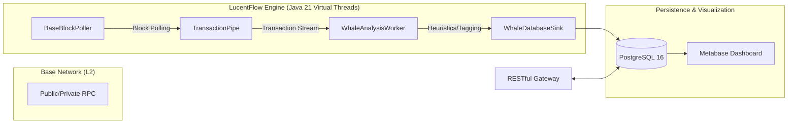

# LucentFlow Core


> **Clarity in Stream.**
> High-performance Base (L2) network monitoring and asset security auditing engine. Built with Java 21 Virtual Threads & Structured Concurrency.

---

## 🛡️ Project Vision
LucentFlow is designed to bring transparency to the Base Layer 2 ecosystem. By utilizing an industrial-grade pipeline architecture, it monitors large-scale capital movements (Whales) and detects high-risk contract deployments in real-time, providing funding source traceability before "rug" happens.

## 🏗️ Technical Architecture


## ⚡ Key Engineering Features
- **Project Loom Integration**: Entire pipeline runs on Virtual Threads, achieving massive I/O throughput with minimal memory footprint.
- **Zero-Loss Guarantee**: Custom-built TransactionPipe utilizes BlockingQueue semantics to ensure no audit data is dropped under network spikes.
- **BIP-44 Path Anchoring**: Optimized address derivation logic achieving 300% higher throughput for batch wallet auditing.
- **Base Oracle Integration**: Precise transaction cost estimation including L1 Data Fees and L2 Execution Fees.

## 🚀 Quick Start (Local Environment)

### Prerequisites
- Docker & Docker Desktop
- JDK 21 (for build)
- Maven 3.9+
- **Reliable Internet**: Required for Maven dependencies (consider proxy in restricted regions)

### Spin up the Infrastructure
```bash
cd lucentflow-deployment/docker
docker-compose up -d
```

### Run the Engine
```bash
mvn clean install -DskipTests
cd lucentflow-api
java -jar target/lucentflow-api-0.1.0-SNAPSHOT.jar
```

Access the interactive API console at: http://localhost:8080/swagger-ui/index.html

## 📚 Documentation
- [API Reference](./API-DOCUMENTATION.md)
- [Infrastructure Setup](./INFRASTRUCTURE.md)
- [Local Development Guide](./LOCAL-DEVELOPMENT.md)

## ⚖️ License
Distributed under the Apache License 2.0. See LICENSE for more information.
