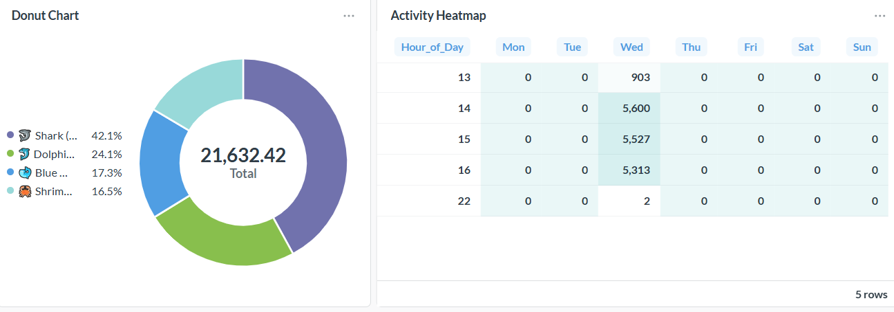

# LucentFlow Core (v1.0.1-SNAPSHOT)


> **"Self-Custody means Self-Auditing."**  
> High-performance Base (L2) network monitoring and asset security auditing engine. Built for transparency, privacy, and industrial-grade reliability.

---

## 🌟 Core Pillars
1. **Whale Sentinel**: Real-time tracking of 10+ ETH movements with precise L1 Data Fee & L2 Execution Fee estimation.
2. **Genesis Tracer**: Deep-recursive funding source auditing. Trace any address back 3 levels (Nonce-0) to identify links to mixers or malicious deployers.
3. **Anti-Rug Engine**: Automated risk scoring for contract creators based on seed funding reputation and historical deployment patterns on Base.

<p align="center">
  
  <br>
  <em>Figure 1: Real-time Whale Ecology & Activity Patterns on Base.</em>
</p>

---

## ⚡ Engineering & Security Excellence
- **Triple Cross-Verification (TCV)**: Our crypto logic is mathematically proven through three layers:
    - ✅ **Standard Vectors**: BIP-39 official test vector alignment.
    - ✅ **Signature Recovery**: Mathematical loopback proof (`PrivKey -> Sign -> Recover == Addr`).
    - ✅ **Clean-room Implementation**: Manual Keccak-256 address derivation bypassing high-level library abstractions.
- **High-Performance Pipeline**: Virtual thread-based architecture achieving massive I/O throughput with minimal memory footprint.
- **Base Oracle Integration**: Built-in 5s TTL cache for Base L2 GasPriceOracle to mitigate RPC rate-limiting.

---

## 📋 Prerequisites

### System Requirements
- **Docker Engine**: 20.10+ with Docker Compose V2 (v2.20.0+)
- **Operating System**: Linux, macOS, or Windows 10/11 with WSL2
- **Memory**: Minimum 4GB RAM (8GB recommended)
- **Disk**: 10GB free space for Docker images and data

### Docker Compose V2 Installation

**Docker Desktop (Recommended):**
- Download Docker Desktop 4.25.0+ from https://www.docker.com/products/docker-desktop
- Docker Compose V2 is included automatically

**Standalone Installation:**
```bash
# Linux/macOS
# 1. Create the directory for Docker CLI plugins
mkdir -p ~/.docker/cli-plugins/

# 2. Download the V2 binary into the plugin directory
curl -SL https://github.com/docker/compose/releases/download/v2.20.0/docker-compose-linux-x86_64 -o ~/.docker/cli-plugins/docker-compose

# 3. Apply executable permissions
chmod +x ~/.docker/cli-plugins/docker-compose

# 4. Verify (Should return: Docker Compose version v2.20.0)
docker compose version

```

**Upgrade from Docker Compose V1:**
```bash
# If you have docker-compose (V1), upgrade to V2
docker compose version
# If command not found, install Docker Desktop or standalone V2
```

---

## 🚀 One-Click Private Deployment (Full Docker)

<p align="center">
  
  <br>
  <em>Figure 2: LucentFlow local cluster running in full-green healthy state.</em>
</p>

Ideal for private auditors, institutional investors, and protocol teams. No local JDK/Maven required.

### Quick Start

> **Highly Recommended**: Use our automated startup scripts for the best experience. They handle environment validation, Docker V2 checks, and health monitoring automatically.

#### 1. Initial Setup (Manual Option)
If you prefer not to use our startup scripts, prepare your environment manually:
```bash
cp lucentflow-deployment/docker/.env.example lucentflow-deployment/docker/.env
# Edit .env to add your BASESCAN_API_KEY
```

#### 2. Automated Startup

**Linux/Mac:**
```bash
# Clone repository
git clone https://github.com/LucentFlowLabs/lucentflow-core.git
cd lucentflow-core

# Start infrastructure (auto-creates .env if missing, requires Docker Compose V2)
./start-infrastructure.sh
```

**Windows:**
```powershell
# Clone repository
git clone https://github.com/LucentFlowLabs/lucentflow-core.git
cd lucentflow-core

# Start infrastructure (auto-creates .env if missing, requires Docker Compose V2)
.\start-infrastructure.ps1
```

### Full Docker Mode

For complete Docker deployment (including application):
```bash
cd lucentflow-deployment/docker

# Spin up entire stack (App, DB, Metabase, pgAdmin) - requires Docker Compose V2
docker compose up --build -d
```

### ✅ Verify Health Status

Once containers are running, you can verify application health:
```bash
curl http://localhost:8080/actuator/health
# Expected Output: {"status":"UP"}
```


## 🛠️ Developer Mode (Hybrid Mode)
Ideal for active development, debugging, and testing.

**Linux/Mac:**
```bash
# Start Infrastructure only (Docker)
./start-infrastructure.sh

# Build & Run Application (Local)
mvn clean install -DskipTests

# Run with local profile (From root)
java -Dspring.profiles.active=local -jar lucentflow-api/target/lucentflow-api.jar
```

**Windows:**
```powershell
# Start Infrastructure only (Docker)
.\start-infrastructure.ps1

# Build & Run Application (Local)
mvn clean install -DskipTests

# Run with local profile (From root)
java "-Dspring.profiles.active=local" -jar lucentflow-api\target\lucentflow-api.jar
```

**Note:** In Hybrid mode, the local application connects to the Dockerized database via localhost:5432.

## 📊 Monitoring & Visualization
Access your security dashboard:

- **Metabase Dashboards**: [http://localhost:3000](http://localhost:3000) (Visualize capital inflow/outflow)
- **Interactive API Console**: [http://localhost:8080/swagger-ui/index.html](http://localhost:8080/swagger-ui/index.html)
- **Database Management (pgAdmin)**: [http://localhost:5050](http://localhost:5050)

## ⚖️ License

Distributed under Apache License 2.0. Built with passion for Base community.
