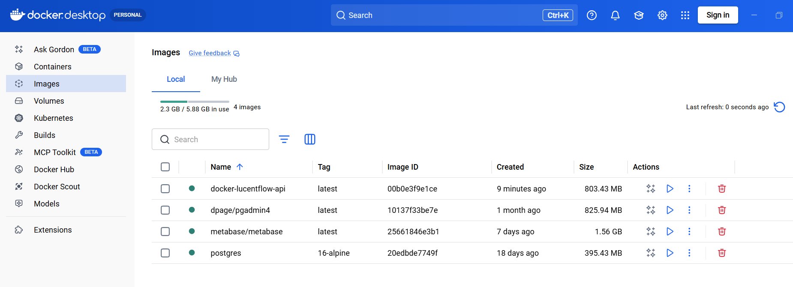

# LucentFlow Core (v1.0.0)

 
 


> **"Self-Custody means Self-Auditing."**  
> High-performance Base (L2) network monitoring and asset security auditing engine. Built for transparency, privacy, and industrial-grade reliability.

---

## 🌟 Core Pillars
1. **Whale Sentinel**: Real-time tracking of 10+ ETH movements with precise L1 Data Fee & L2 Execution Fee estimation.
2. **Genesis Tracer**: Deep-recursive funding source auditing. Trace any address back 3 levels (Nonce-0) to identify links to mixers or malicious deployers.
3. **Anti-Rug Engine**: Automated risk scoring for contract creators based on seed funding reputation and historical deployment patterns on Base.

## ⚡ Engineering & Security Excellence
- **Triple Cross-Verification (TCV)**: Our crypto logic is mathematically proven through three layers:
    - ✅ **Standard Vectors**: BIP-39 official test vector alignment.
    - ✅ **Signature Recovery**: Mathematical loopback proof (`PrivKey -> Sign -> Recover == Addr`).
    - ✅ **Clean-room Implementation**: Manual Keccak-256 address derivation bypassing high-level library abstractions.
- **High-Performance Pipeline**: Virtual thread-based architecture achieving massive I/O throughput with minimal memory footprint.
- **Base Oracle Integration**: Built-in 5s TTL cache for Base L2 GasPriceOracle to mitigate RPC rate-limiting.

---

## 🚀 One-Click Private Deployment (Full Docker)

<p align="center">
  
  <br>
  <em>Figure 1: LucentFlow local cluster running in full-green healthy state.</em>
</p>

Ideal for private auditors, whales, and protocol teams. No local JDK/Maven required.

### Quick Start
### 1. Initial Setup (Manual Option)
If you prefer not to use our startup scripts, prepare your environment manually:
```bash
cp lucentflow-deployment/docker/.env.example lucentflow-deployment/docker/.env
# Edit .env to add your BASESCAN_API_KEY

**Linux/Mac:**
```bash
# Clone repository
git clone https://github.com/YourUsername/lucentflow-core.git
cd lucentflow

# Start infrastructure (auto-creates .env if missing)
./start-infrastructure.sh
```

**Windows:**
```powershell
# Clone repository
git clone https://github.com/YourUsername/lucentflow-core.git
cd lucentflow

# Start infrastructure (auto-creates .env if missing)
.\start-infrastructure.ps1
```

### Full Docker Mode

For complete Docker deployment (including application):
```bash
cd lucentflow-deployment/docker

# Spin up entire stack (App, DB, Metabase, pgAdmin)
docker-compose up --build -d
```

### ✅ Verify Health Status

Once containers are running, you can verify application health:
```bash
curl http://localhost:8080/actuator/health
# Expected Output: {"status":"UP"}
```

## 🛠️ Developer Mode (Hybrid Mode)
Ideal for active development, debugging, and testing.

**Linux/Mac:**
```bash
# Start Infrastructure only (Docker)
./start-infrastructure.sh

# Build & Run Application (Local)
cd ../..
mvn clean install -DskipTests
cd lucentflow-api

# Run with local profile
java "-Dspring.profiles.active=local" \
     "-Dhttps.proxyHost=127.0.0.1" \
     "-Dhttps.proxyPort=10808" \
     -jar lucentflow-api/target/lucentflow-api-1.0.0-RELEASE.jar
```

**Windows:**
```powershell
# Start Infrastructure only (Docker)
.\start-infrastructure.ps1

# Build & Run Application (Local)
cd ..\..\nmvn clean install -DskipTests
cd lucentflow-api

# Run with local profile
java "-Dspring.profiles.active=local" `
     "-Dhttps.proxyHost=127.0.0.1" `
     "-Dhttps.proxyPort=10808" `
     -jar lucentflow-api\target\lucentflow-api-1.0.0-RELEASE.jar
```

Note: In Hybrid mode, local app connects to Dockerized DB via localhost:5432.

## 📊 Monitoring & Visualization
Access your pre-configured security cockpit:

- **Metabase Dashboards**: [http://localhost:3000](http://localhost:3000) (Visualize capital inflow/outflow)
- **Interactive API Console**: [http://localhost:8080/swagger-ui/index.html](http://localhost:8080/swagger-ui/index.html)
- **Database Management (pgAdmin)**: [http://localhost:5050](http://localhost:5050)

## ⚖️ License

Distributed under Apache License 2.0. Built with passion for Base community.
