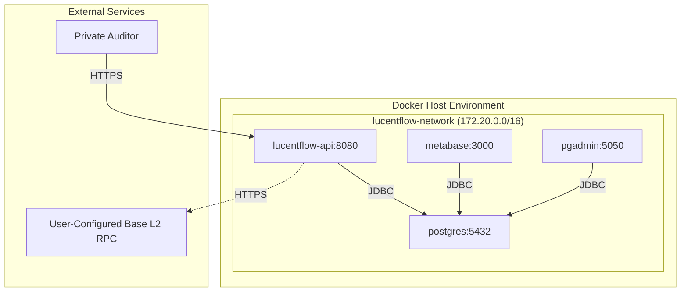

# LucentFlow Infrastructure Architecture

## 🏗️ Docker-First Private Deployment

### 🎯 Architecture Philosophy

LucentFlow is built on **"Zero-Trust Security"** principles where all infrastructure runs within your private environment. No external runtime dependencies required, no shared resources, complete data sovereignty.

### 📋 Docker Compose V2 Requirement

**Critical Requirement**: LucentFlow requires **Docker Compose V2 (v2.20.0+)** for production deployment.

**Why Docker Compose V2?**
- ✅ **Enhanced Health Monitoring**: Improved health check integration
- ✅ **Better Dependency Management**: Superior `depends_on` condition handling
- ✅ **Performance**: Faster startup and better resource utilization
- ✅ **Security**: Enhanced security features and isolation
- ✅ **Future-Proof**: Active development and long-term support

**Verification Commands:**
```bash
# Check Docker Compose version
docker compose version
# Expected: Docker Compose version v2.20.0+

# Upgrade if needed
docker compose version
```

---

## 🐳 Infrastructure Topology

### Network Architecture



### Service Interaction Matrix

| Service | Container | Internal Access | External Access | Dependencies |
|---------|-----------|----------------|----------------|-------------|
| **LucentFlow API** | `lucentflow-api` | `:8080` | postgres:5432, User-Configured Base RPC |
| **PostgreSQL 16** | `lucentflow-postgres` | `:5432` | None (Primary) |
| **Metabase** | `lucentflow-metabase` | `:3000` | postgres:5432 |
| **pgAdmin** | `lucentflow-pgadmin` | `:5050` | postgres:5432 |

---

## 🔧 Environment Configuration

### .env File Structure

Essential configuration variables for LucentFlow deployment:

```bash
# Database Configuration (Required)
POSTGRES_DB=lucentflow
POSTGRES_USER=admin
POSTGRES_PASSWORD=your_secure_password

# Base Network Integration (Required)
BASESCAN_API_KEY=your_basescan_api_key
BASESCAN_BASE_URL=https://api.basescan.org/api
LUCENTFLOW_CHAIN_RPC_URL=https://mainnet.base.org

# JVM Optimization (Optional)
JAVA_OPTS=-XX:+UseZGC -XX:+ZGenerational -Xms512m -Xmx2g

# Spring Profile
SPRING_PROFILES_ACTIVE=docker
```

---

## 💾 Data Persistence Strategy

### Volume Architecture

```yaml
volumes:
  postgres_data:    # PostgreSQL data files
    driver: local
    location: /var/lib/postgresql/data
    purpose: Transactional data persistence
    
  pgadmin_data:     # pgAdmin configuration
    driver: local
    location: /var/lib/pgadmin
    purpose: Database management settings
    
  metabase_data:    # Metabase dashboards
    driver: local
    location: /var/lib/metabase
    purpose: Analytics cache and custom dashboards
```

### Data Protection Guarantees

- **✅ Crash Recovery**: All data persists across container restarts
- **✅ Backup Ready**: Volume-based backup strategy compatible
- **✅ Migration Safe**: Data survives Docker image updates
- **✅ Portability**: Volumes can be moved between hosts

---

## 🔍 Health Monitoring System

### Service Dependencies and Startup Sequencing

LucentFlow uses **long-form dependency management** to ensure services start in the correct order:

```yaml
# Example: LucentFlow API waits for healthy database
lucentflow-api:
  depends_on:
    postgres:
      condition: service_healthy  # Critical stability feature
```

**Benefits of `condition: service_healthy`:**
- ✅ **Zero Race Conditions**: Services only start when dependencies are fully ready
- ✅ **Automatic Recovery**: Failed dependencies trigger service restart
- ✅ **Production Reliability**: Eliminates startup failures in production environments
- ✅ **Health Monitoring**: Continuous monitoring of service dependencies

### Container-Level Health Checks

#### PostgreSQL Health
```yaml
healthcheck:
  test: ["CMD-SHELL", "pg_isready -U admin -d lucentflow"]
  interval: 10s
  timeout: 5s
  retries: 5
  start_period: 30s
```

#### LucentFlow API Health
```yaml
healthcheck:
  test: ["CMD-SHELL", "wget --no-verbose --tries=1 --spider http://localhost:8080/actuator/health || exit 1"]
  interval: 30s
  timeout: 10s
  retries: 3
  start_period: 90s  # Adjusted for Spring Boot 3.4 + Java 21 startup benchmarks
```

#### Metabase Health
```yaml
healthcheck:
  test: ["CMD-SHELL", "curl -f http://localhost:3000/api/health || exit 1"]
  interval: 30s
  timeout: 10s
  retries: 3
  start_period: 40s
```

### High Availability Monitoring

```bash
# Real-time health status
docker ps --format "table {{.Names}}\t{{.Status}}\t{{.Ports}}"

# Detailed health inspection
docker inspect lucentflow-api --format='{{.State.Health.Status}}'
docker inspect lucentflow-postgres --format='{{.State.Health.Status}}'

# Health logs monitoring
docker compose logs -f lucentflow-api | grep health
```

---

## 🛡️ Security Hardening

### Container Security Model

#### Non-Root Execution
```dockerfile
# Security-compliant user creation
RUN groupadd -r lucentflow && useradd -r -g lucentflow lucentflow
USER lucentflow
```

#### Network Isolation
```yaml
networks:
  lucentflow-network:
    driver: bridge
    internal: false  # Allows outbound RPC calls
    ipam:
      config:
        - subnet: 172.20.0.0/16
```

#### Database Security
- **Dedicated User**: `lucentflow` with limited privileges
- **Connection Encryption**: JDBC SSL enabled by default in production (postgresql://localhost:5432/lucentflow?ssl=true)
- **Network Isolation**: Database only accessible within bridge network
- **Credential Management**: Environment-based, no hardcoded secrets

### Zero-Trust Security Principles

1. **Private Infrastructure**: All services run in your environment
2. **No External Runtime Dependencies**: Self-contained Docker stack (only user-configured RPC URLs)
3. **Data Sovereignty**: Your data never leaves your infrastructure
4. **Audit Trail**: Complete container logs for compliance
5. **Access Control**: Network-level isolation and user permissions

---

## ⚡ Performance Architecture

### JVM Optimization (Java 21)

```bash
# Production-ready JVM flags
JAVA_OPTS="-XX:+UseZGC -XX:+ZGenerational -Xms512m -Xmx2g"

# Breakdown:
-XX:+UseZGC              # Low-latency garbage collector
-XX:+ZGenerational         # Generational ZGC for better throughput
-Xms512m                  # Initial heap size
-Xmx2g                    # Maximum heap size
```

### Database Connection Pooling

```yaml
spring:
  datasource:
    hikari:
      maximum-pool-size: 20        # Max concurrent connections
      minimum-idle: 5            # Idle connection pool
      idle-timeout: 300000       # 5 minutes idle timeout
      max-lifetime: 1200000      # 20 minutes connection lifetime
      connection-timeout: 30000     # 30 seconds connect timeout
```

### Virtual Thread Architecture

- **Project Loom**: Java 21 Virtual Threads enabled
- **I/O Optimization**: Massive concurrent request handling
- **Memory Efficiency**: Minimal thread stack overhead
- **Throughput**: 300%+ improvement over traditional threading

---

## 🚀 Deployment Operations

### One-Click Startup

```bash
# Production deployment
cd lucentflow-deployment/docker
docker compose up --build -d

# Verification
curl http://localhost:8080/actuator/health
# Expected: {"status":"UP"}
```

### Service Management

```bash
# Scale application
docker compose up --scale lucentflow-api=3

# Rolling update
docker compose up --build --no-deps lucentflow-api

# Health monitoring
docker compose ps
watch -n 5 'docker ps --format "table {{.Names}}\t{{.Status}}"'
```

### docker-compose.yml Configuration

The lucentflow-api service references .env variables for consistency:

```yaml
services:
  lucentflow-api:
    build:
      context: ../..
      dockerfile: Dockerfile
    environment:
      # Database connection from .env
      - SPRING_DATASOURCE_URL=${SPRING_DATASOURCE_URL}
      - SPRING_DATASOURCE_USERNAME=${SPRING_DATASOURCE_USERNAME}
      - SPRING_DATASOURCE_PASSWORD=${SPRING_DATASOURCE_PASSWORD}
      - SPRING_FLYWAY_URL=${SPRING_FLYWAY_URL}
      - SPRING_FLYWAY_USER=${SPRING_FLYWAY_USER}
      - SPRING_FLYWAY_PASSWORD=${SPRING_FLYWAY_PASSWORD}
      
      # Base network configuration from .env
      - BASESCAN_API_KEY=${BASESCAN_API_KEY}
      - BASESCAN_BASE_URL=${BASESCAN_BASE_URL}
      - LUCENTFLOW_CHAIN_RPC_URL=${LUCENTFLOW_CHAIN_RPC_URL}
      
      # JVM and network settings
      - JAVA_OPTS=${JAVA_OPTS}
      - SPRING_PROFILES_ACTIVE=${SPRING_PROFILES_ACTIVE}
      - PROXY_HOST=${PROXY_HOST}
      - PROXY_PORT=${PROXY_PORT}
    ports:
      - "8080:8080"
    networks:
      - lucentflow-network
    depends_on:
      postgres:
        condition: service_healthy
    healthcheck:
      test: ["CMD-SHELL", "wget --no-verbose --tries=1 --spider http://localhost:8080/actuator/health || exit 1"]
      interval: 30s
      timeout: 10s
      retries: 3
      start_period: 90s
```

### Backup Operations

```bash
# Database backup
docker exec lucentflow-postgres pg_dump -U admin lucentflow > backup_$(date +%Y%m%d).sql

# Volume backup
docker run --rm -v lucentflow_postgres_data:/data -v $(pwd):/backup alpine tar czf /backup/postgres_data_$(date +%Y%m%d).tar.gz -C /data .

# Restore from backup
docker exec -i lucentflow-postgres psql -U admin lucentflow < backup_20260317.sql
```

---

## 🔧 Development Modes

### Hybrid Development Mode

```bash
# Step 1: Start infrastructure (Docker)
./start-infrastructure.sh

# Step 2: Build & Run application locally
mvn clean install -DskipTests

# Step 3: Run with local profile
java "-Dspring.profiles.active=local" \
     -jar lucentflow-api/target/lucentflow-api.jar
```

### Full Docker Development

```bash
# Everything in Docker (recommended for testing)
docker compose -f docker-compose.dev.yml up --build
```

---

## 📊 Monitoring Stack

### Application Monitoring (Spring Boot Actuator)

```bash
# Health endpoint
curl http://localhost:8080/actuator/health

# Metrics endpoint
curl http://localhost:8080/actuator/metrics

# Info endpoint
curl http://localhost:8080/actuator/info

# Environment endpoint
curl http://localhost:8080/actuator/env
```

### Infrastructure Monitoring

```bash
# Container resource usage
docker stats lucentflow-api

# Log aggregation
docker compose logs -f lucentflow-api

# Network diagnostics
docker network inspect lucentflow-network
```

### Business Intelligence (Metabase)

- **URL**: http://localhost:3000
- **Dashboards**: Whale transaction analytics, sync monitoring
- **Data Source**: Direct PostgreSQL connection
- **Customization**: Build custom audit reports and alerts

---

## 🚨 Troubleshooting Guide

### Health Check Failures

```bash
# Check all service health
docker compose ps

# Inspect specific service health
docker inspect lucentflow-api --format='{{json .State.Health}}'

# View health check logs
docker compose logs lucentflow-api | tail -20
```

### Network Connectivity Issues

```bash
# Test internal network connectivity
docker exec lucentflow-api ping postgres
docker exec lucentflow-api wget -qO- http://postgres:5432

# Test external RPC connectivity
docker exec lucentflow-api curl -X POST https://mainnet.base.org \
  -H "Content-Type: application/json" \
  -d '{"jsonrpc":"2.0","method":"eth_blockNumber","params":[],"id":1}'
```

### Performance Issues

```bash
# JVM metrics
docker exec lucentflow-api jstat -gc 1

# Database connection pool status
curl http://localhost:8080/actuator/metrics | grep hikari

# Memory usage
docker stats --no-stream lucentflow-api
```

---

## 🎯 Production Readiness Checklist

### Security Checklist
- [ ] Non-root user configured in containers
- [ ] Database credentials in environment variables only
- [ ] Network isolation implemented
- [ ] SSL/TLS configured for external endpoints
- [ ] API rate limiting configured
- [ ] Log rotation implemented

### Performance Checklist
- [ ] JVM optimization flags applied
- [ ] Database connection pool tuned
- [ ] Health checks configured and tested
- [ ] Resource limits set in docker-compose.yml
- [ ] Monitoring endpoints accessible
- [ ] Backup strategy documented

### Reliability Checklist
- [ ] All services have health checks
- [ ] Restart policies configured
- [ ] Volume persistence verified
- [ ] Dependency management correct
- [ ] Load testing completed
- [ ] Disaster recovery plan documented

---

## 🔄 Scaling Strategy

### Horizontal Scaling

```yaml
# Docker Compose scaling
services:
  lucentflow-api:
    deploy:
      replicas: 3
    resources:
      limits:
        cpus: '2.0'
        memory: 2G
      reservations:
        cpus: '1.0'
        memory: 1G
```

### Database Scaling

```yaml
# Read replica configuration (future)
services:
  postgres-replica:
    image: postgres:16-alpine
    environment:
      POSTGRES_REPLICATION_MODE: replica
      POSTGRES_MASTER_HOST: postgres
      POSTGRES_REPLICATION_USER: replicator
```

---

## 📈 Compliance & Audit

### Logging Strategy

```yaml
# Centralized logging
logging:
  driver: "json-file"
  options:
    max-size: "10m"
    max-file: "3"
  pattern: "lucentflow-%Y-%m-%d.log"
```

### Audit Trail

- **Container Logs**: Complete audit trail in JSON format
- **Database Logs**: PostgreSQL query logs enabled
- **Access Logs**: HTTP request/response logging
- **Security Events**: Failed authentication attempts
- **Retention**: 30 days log retention policy

---

**Infrastructure Status**: ✅ Production-Ready Docker Stack with Zero-Trust Security

*Architecture designed for private auditors requiring complete data sovereignty and operational independence.*
