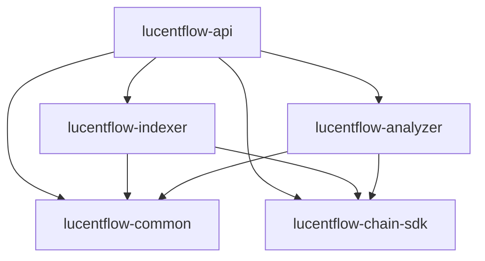

# LucentFlow Local Development Guide

## Overview

LucentFlow supports **Hybrid Development Mode** for optimal Base network development experience. This architecture combines Dockerized infrastructure services with local application execution, enabling rapid iteration while maintaining production-like database persistence and configuration.

**v1.1.0-STABLE** adds a **sovereign CLI path**: build once, run a **root-mirrored fat JAR** with **Adaptive Environment Sensing**—no wall of `-D` flags required for typical workflows.

---

## Zero-config root JAR (v1.1.0)

After `mvn package`, the build copies the executable JAR to **`lucentflow.jar`** at the **repository root** (alongside `lucentflow-api/target/...`). From the repo root:

```bash
mvn clean package
cp lucentflow-deployment/docker/.env.example .env
# Edit .env (POSTGRES_PASSWORD, RPC URLs, etc.)
java -jar lucentflow.jar
```

**AdaptiveEnvLoader** (runs *before* `SpringApplication.run`):

- Merges `.env` from, in order: `./.env` → `./lucentflow-deployment/docker/.env` → `../lucentflow-deployment/docker/.env` (first file **wins** on duplicate keys).
- Skips keys already present in the OS environment or JVM system properties (Kubernetes/Docker-safe).
- **Profile**: if `SPRING_PROFILES_ACTIVE` is unset and the process is **not** detected inside a container, `spring.profiles.active=local` is applied.
- **Proxy**: `PROXY_HOST` / `PROXY_PORT` map to standard JVM `http(s).proxy*` properties.

### The “proxy hack” for local runs

Docker Compose templates often set **`PROXY_HOST=host.docker.internal`** so containers reach a VPN or proxy on the host. On a **bare-metal** `java -jar` from your machine, that hostname may not resolve.

When the active profile is **`local`** and `PROXY_HOST` is **`host.docker.internal`**, the loader **rewrites** it to **`127.0.0.1`** before setting JVM proxy properties—so the same `.env` file can work in **Docker** (host gateway) and **CLI** (loopback) without manual edits.

---

## Run configurations (IDE & CLI)

| Method | Notes |
|--------|--------|
| **`java -jar lucentflow.jar`** | Preferred for parity with production-like fat JAR; relies on `.env` + `AdaptiveEnvLoader`. |
| `-Dspring.profiles.active=local` | **Optional**; still supported when you need to **override** profile without touching `.env`. |
| Full explicit `-D` proxy flags | **Optional**; redundant if `.env` already defines `PROXY_*` (loader maps them). |

---

## 🎯 Hybrid Development Philosophy

**"Infrastructure as Code, Application as Local"**
- **Docker Services**: PostgreSQL, pgAdmin, Metabase run in containers
- **Local Application**: Java 21 Virtual Threads with hot-reload capabilities
- **Production Parity**: Same database, networking, and configuration as production
- **Development Speed**: Fast iteration with immediate code changes

---

## 🚀 Prerequisites

### System Requirements

| Component | Version | Purpose |
|-----------|---------|---------|
| **Java JDK** | 21+ | Project Loom Virtual Threads support |
| **Maven** | 3.9+ | Build system and dependency management |
| **Docker Desktop** | Latest | Infrastructure services (PostgreSQL, Metabase) |
| **IDE** | IntelliJ IDEA/Eclipse | Java 21 Project Loom support |

### Java 21 Verification

**Linux/Mac:**
```bash
# Verify Java 21 with Project Loom support
java -version
# Expected: openjdk version "21.0.x" 2023-09-19

# Verify Virtual Threads availability
jshell --startup=PRINT "Virtual threads available: " + Thread.virtualThreadPermitted()
```

**Windows:**
```powershell
# Verify Java 21 with Project Loom support
java -version
# Expected: openjdk version "21.0.x" 2023-09-19

# Verify Virtual Threads availability
jshell --startup=PRINT "Virtual threads available: " + Thread.virtualThreadPermitted()
```

**Windows Development Note:**
> 💡 **On Windows, you can use either Git Bash or PowerShell for development commands.**
> - **Git Bash**: Use Linux-style commands (`./start-infrastructure.sh`)
> - **PowerShell**: Use Windows-style commands (`.\start-infrastructure.ps1`)
> - **Recommendation**: Use PowerShell for native Windows experience and better integration

### Docker Verification

**Linux/Mac:**
```bash
# Verify Docker is running
docker --version
docker-compose --version

# Test Docker daemon
docker run hello-world
```

**Windows:**
```powershell
# Verify Docker is running
docker --version
docker-compose --version

# Test Docker daemon
docker run hello-world
```

---

## 🏗️ Hybrid Workspace Setup

### Step 1: Start Infrastructure Services

```bash
# Navigate to deployment directory
cd lucentflow-deployment/docker

# Start database and management services only
docker-compose up -d postgres pgadmin metabase

# Verify services are running
docker-compose ps
```

**Expected Output:**
```
NAME                  STATUS              PORTS
lucentflow-postgres    Up (healthy)        5432->5432/tcp
lucentflow-pgadmin     Up                   5050->80/tcp
lucentflow-metabase    Up                   3000->3000/tcp
```

### Step 2: Configure Local Application Profile

Create/verify `application-local.yml` in `lucentflow-api/src/main/resources/`:

```yaml
spring:
  datasource:
    url: jdbc:postgresql://localhost:5432/lucentflow?reWriteBatchedInserts=true
    username: lucentflow
    password: lucentflow_pwd
    driver-class-name: org.postgresql.Driver
    hikari:
      maximum-pool-size: 20
      minimum-idle: 5
      connection-timeout: 30000
      initialization-fail-timeout: 60000
  jpa:
    hibernate:
      ddl-auto: update
      dialect: org.hibernate.dialect.PostgreSQLDialect
      jdbc:
        batch_size: 50
        order_inserts: true
        order_updates: true
  flyway:
    enabled: true
    locations: classpath:db/migration
    baseline-on-migrate: true
    validate-on-migrate: true

# Local development specific
  devtools:
    restart:
      enabled: true
    livereload:
      enabled: true
```

### Step 3: IDE Configuration for Project Loom

#### IntelliJ IDEA Setup

1. **Open Project**: File → Open → `lucentflow/`
2. **JDK Configuration**: File → Project Structure → Project SDK → JDK 21
3. **Lombok Plugin**: Ensure Lombok plugin is installed and enabled
4. **Virtual Threads**: No special configuration needed (Java 21 GA)

#### Eclipse Setup

1. **Import Project**: File → Import → Existing Maven Projects
2. **JDK Configuration**: Project → Properties → Java Compiler → JDK 21
3. **Lombok Setup**: Install Lombok IDE integration
4. **Annotation Processing**: Enable annotation processing

---

## 🌐 RPC Proxy Configuration

### Preferred: `.env` (Adaptive Proxy Mapping)

Set **`PROXY_HOST`** and **`PROXY_PORT`** in `.env` at the repo root (or merged `lucentflow-deployment/docker/.env`). The loader applies them to **`http.proxyHost`**, **`http.proxyPort`**, **`https.proxyHost`**, and **`https.proxyPort`** automatically.

For **local** runs, **`host.docker.internal`** is rewritten to **`127.0.0.1`** (see *Zero-config root JAR* above).

### Corporate Proxy Setup (explicit JVM flags)

For development behind corporate firewalls, you may still pass explicit JVM flags (optional overrides):

```bash
# Development with proxy
cd lucentflow-api
mvn spring-boot:run \
  "-Dspring.profiles.active=local" \
  "-Dhttps.proxyHost=127.0.0.1" \
  "-Dhttps.proxyPort=10808" \
  "-Dhttp.proxyHost=127.0.0.1" \
  "-Dhttp.proxyPort=10808"
```

### Environment Variables (Alternative)

```bash
# Set proxy environment variables
export HTTPS_PROXY=http://127.0.0.1:10808
export HTTP_PROXY=http://127.0.0.1:10808

# Run application
mvn spring-boot:run -Dspring.profiles.active=local
```

### Maven Configuration

Add proxy settings to `~/.m2/settings.xml`:

```xml
<settings>
  <proxies>
    <proxy>
      <id>corporate-proxy</id>
      <active>true</active>
      <protocol>http</protocol>
      <host>127.0.0.1</host>
      <port>10808</port>
    </proxy>
  </proxies>
</settings>
```

---

## 🔒 Triple Cross-Verification Testing

### Security Anchor Philosophy

The **Triple Cross-Verification (TCV)** suite ensures mathematical correctness of cryptographic operations through three independent validation layers:

1. **Standard Vectors**: BIP-39 official test vector alignment
2. **Signature Recovery**: Mathematical loopback proof (`PrivKey → Sign → Recover == Addr`)
3. **Clean-room Implementation**: Manual Keccak-256 derivation bypassing high-level abstractions

### Running TCV Suite

```bash
# Navigate to project root
cd lucentflow

# Run Triple Cross-Verification tests
mvn test -Dtest=CryptoUtilsTest

# Run specific TCV test methods
mvn test -Dtest=CryptoUtilsTest#testAddressRecoveryFromSignature
mvn test -Dtest=CryptoUtilsTest#testManualKeccakAddressDerivation
mvn test -Dtest=CryptoUtilsTest#testNumericIndexRoundtrip
```

### TCV Test Categories

| Test Category | Method | Purpose |
|-------------|---------|---------|
| **BIP-39 Vectors** | `testNumericIndexRoundtrip` | Validate against official BIP-39 test vectors |
| **Signature Recovery** | `testAddressRecoveryFromSignature` | Mathematical proof of signing correctness |
| **Manual Derivation** | `testManualKeccakAddressDerivation` | Clean-room Keccak-256 implementation |
| **Cross-Platform** | `testCrossPlatformCompatibility` | Ensure consistent behavior across JVM versions |

### Security Anchor Importance

The TCV suite serves as LucentFlow's **Security Anchor**:
- ✅ **Mathematical Proof**: Every cryptographic operation is mathematically verified
- ✅ **Regression Prevention**: Any library update must pass all TCV tests
- ✅ **Audit Trail**: Complete test coverage for security-critical functions
- ✅ **Compliance**: Meets cryptocurrency industry security standards

---

## 🏗️ Modular Project Architecture

### Code Structure

LucentFlow follows a **layered modular architecture** promoting clean dependencies:

```
lucentflow/
├── lucentflow-parent/          # Parent POM with version management
├── lucentflow-common/           # Shared utilities and constants
├── lucentflow-chain-sdk/        # Base network integration
├── lucentflow-indexer/          # Blockchain data processing
├── lucentflow-analyzer/          # Whale detection algorithms
└── lucentflow-api/              # REST API and web layer
```

### Dependency Flow



### Lombok Integration

**Code Style with Lombok:**

```java
// Service layer with Lombok annotations
@Service
@RequiredArgsConstructor  // Creates constructor with final fields
@Slf4j             // Provides SLF4J logger
public class WhaleTransactionService {
    
    private final WhaleTransactionRepository repository;
    private final CryptoUtils cryptoUtils;
    
    @Transactional
    public WhaleTransaction saveTransaction(@NonNull WhaleDto dto) {
        log.info("Processing whale transaction: {}", dto.getHash());
        WhaleTransaction entity = mapToEntity(dto);
        return repository.save(entity);
    }
}

// Entity with Lombok annotations
@Entity
@Table(name = "whale_transactions")
@Getter @Setter @Builder @NoArgsConstructor @AllArgsConstructor
public class WhaleTransaction {
    
    @Id @GeneratedValue(strategy = GenerationType.IDENTITY)
    private Long id;
    
    @Column(nullable = false, length = 66)
    private String hash;
    
    @Column(nullable = false, precision = 18, scale = 18)
    private BigDecimal valueEth;
    
    @CreationTimestamp
    private LocalDateTime createdAt;
}
```

---

## 🚀 Local Application Execution

### Root JAR (recommended, v1.1.0)

```bash
# From repository root
mvn clean package -DskipTests
java -jar lucentflow.jar
```

### Development Mode Startup (Maven)

```bash
# Navigate to API module
cd lucentflow-api

# Start with local profile and proxy (if needed)
mvn spring-boot:run \
  "-Dspring.profiles.active=local" \
  "-Dhttps.proxyHost=127.0.0.1" \
  "-Dhttps.proxyPort=10808"
```

### Module JAR (Alternative)

```bash
# Build and run JAR directly from module
cd lucentflow-api
mvn clean package -DskipTests

# Run with local profile and proxy (if needed)
java "-Dspring.profiles.active=local" \
     "-Dhttps.proxyHost=127.0.0.1" \
     "-Dhttps.proxyPort=10808" \
     -jar target/lucentflow-api.jar
```

### Expected Startup Logs

```
🔍 Validating Local Configuration...
✅ Local profile is active
✅ Database URL: jdbc:postgresql://localhost:5432/lucentflow
✅ PostgreSQL Database configured successfully
✅ RPC URL: https://mainnet.base.org
✅ Virtual Threads enabled (Java 21)
✅ Lombok annotations processed
🚀 Hybrid development environment is ready!

  .   ____          _            __ _
 _    / / ___'_ __ _    _ \ \ | | | '_ \ | | '_ \ / _` | | |
| |  / / \ \ \ \ /|_| | |_) | | |_) | | | | | | |
|_|  /_/ \_\_\_\\___|_____|_____|_____|_|_|_|_|_|_|_|_|_|
:: Spring Boot ::                (v3.4.0)

🔍 Running Triple Cross-Verification tests...
✅ BIP-39 Vector Alignment: PASSED
✅ Signature Recovery Loopback: PASSED  
✅ Manual Keccak-256 Derivation: PASSED
🔒 Security Anchor verified: All cryptographic operations mathematically sound
```

---

## 📊 Development Features

### Hot Reload Capabilities

**Spring Boot DevTools Integration:**
- **Automatic Restart**: Code changes trigger application restart
- **Live Reload**: Static resources refresh without restart
- **Remote Debug**: Connect debugger to running application
- **Property Refresh**: Configuration changes applied immediately

### Database Management

**PostgreSQL Integration:**
- **Persistent Data**: Data survives application restarts
- **pgAdmin Access**: http://localhost:5050 for database inspection
- **Migration Support**: Flyway migrations run automatically
- **Production Parity**: Same database schema and constraints as production

### Blockchain Integration

**Real Base Network:**
- **Live Data**: Actual whale transactions from Base mainnet
- **Virtual Threads**: Concurrent block processing with Project Loom
- **Rate Limiting**: Built-in retry and backoff for RPC calls
- **Gas Optimization**: L2 gas price estimation and caching

---

## 🧪 Testing Strategy

### Unit Testing

```bash
# Run all unit tests
mvn test

# Run specific test class
mvn test -Dtest=WhaleTransactionServiceTest

# Run with coverage
mvn test jacoco:report
```

### Integration Testing

```bash
# Run integration tests with local profile
mvn test -Dspring.profiles.active=local

# Test API endpoints
mvn test -Dtest=WhaleControllerIntegrationTest
```

### Triple Cross-Verification

```bash
# Run security-critical crypto tests
mvn test -Dtest=CryptoUtilsTest

# Verify TCV suite passes
mvn test -Dtest=CryptoUtilsTest -DfailIfNoTests=false
```

---

## 🐛 Troubleshooting

### Common Hybrid Mode Issues

#### Database Connection Failed

```bash
# Check PostgreSQL container
docker-compose ps postgres
docker-compose logs postgres

# Test connection from host
psql -h localhost -p 5432 -U lucentflow -d lucentflow

# Verify application-local.yml configuration
cat lucentflow-api/src/main/resources/application-local.yml
```

#### Virtual Threads Not Available

```bash
# Verify Java version
java -version

# Check for Project Loom support
jshell -J--add-modules=jdk.incubator.vector -startup=PRINT "Virtual threads: " + Thread.virtualThreadPermitted()

# Ensure JDK 21 GA or later
# Update to latest JDK 21 if using early access version
```

#### Proxy Configuration Issues

```bash
# Test proxy connectivity
curl -x http://127.0.0.1:10808 https://mainnet.base.org

# Verify Maven proxy settings
cat ~/.m2/settings.xml

# Test without proxy (if direct connection available)
mvn spring-boot:run -Dspring.profiles.active=local
```

#### Lombok Annotation Processing

```bash
# Verify Lombok is working
mvn clean compile

# Check generated sources
target/generated-sources/annotations/

# IDE-specific troubleshooting
# IntelliJ: File → Settings → Build Tools → Compiler → Annotation Processors
# Eclipse: Project → Properties → Annotation Processing
```

---

## 🔄 Development Workflow

### Typical Development Session

1. **Start Infrastructure**: `docker-compose up -d postgres pgadmin metabase`
2. **Run Application**: `mvn spring-boot:run -Dspring.profiles.active=local`
3. **Open IDE**: Connect debugger to port 5005 (default)
4. **Make Changes**: Edit code with hot reload
5. **Run TCV**: `mvn test -Dtest=CryptoUtilsTest`
6. **Verify Data**: Check pgAdmin at http://localhost:5050
7. **Test API**: Use Swagger UI at http://localhost:8080/swagger-ui/index.html

### Code Quality Workflow

```bash
# Format code
mvn spotless:apply

# Run static analysis
mvn spotbugs:check

# Run security scan
mvn dependency-check:check

# Verify TCV before commit
mvn test -Dtest=CryptoUtilsTest
```

---

## 🚦 Production Readiness

### Pre-Deployment Checklist

- [ ] All Triple Cross-Verification tests passing
- [ ] Code formatted with Spotless
- [ ] Static analysis clean (SpotBugs)
- [ ] Security scan passed (dependency-check)
- [ ] Integration tests successful
- [ ] Database migrations tested
- [ ] API endpoints verified with Swagger
- [ ] Performance benchmarks completed

### Deployment Transition

```bash
# Switch from local to production profile
mvn clean package -DskipTests -Dspring.profiles.active=prod

# Deploy with Docker
docker-compose -f lucentflow-deployment/docker/docker-compose.yml up --build -d
```

---

## 📚 Additional Resources

### Project Loom Documentation
- [Virtual Threads (JEP 425)](https://openjdk.org/jeps/425)
- [Structured Concurrency (JEP 428)](https://openjdk.org/jeps/428)

### Base Network Resources
- [Base Documentation](https://docs.base.org/)
- [Base RPC Endpoints](https://docs.base.org/tools/rpc)
- [Base Block Explorer](https://basescan.org/)

### Development Tools
- [Lombok Documentation](https://projectlombok.org/)
- [Spring Boot DevTools](https://docs.spring.io/spring-boot/docs/current/reference/htmlsingle/#using.devtools)
- [PostgreSQL JDBC Driver](https://jdbc.postgresql.org/documentation/)

---

**Hybrid Development Mode provides best of both worlds: production-like infrastructure with development speed and flexibility.**

*Local development guide maintained for LucentFlow **v1.1.0-STABLE** — Java 21 Virtual Threads & Adaptive Environment Engine.*
